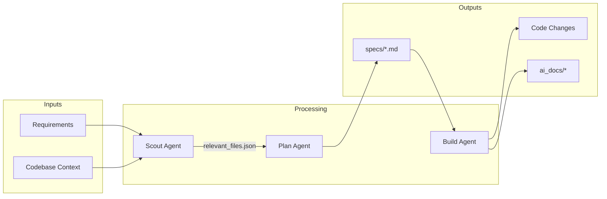

<!--
README.beautified.md - Geometric/Technical Style
Generated: 2025-11-23
Style: Minimal prose, maximum diagrams, technical precision
Changes from original:
- Added architecture mermaid diagram
- Added data flow diagram
- Converted workflow to visual flowchart
- Reduced prose, increased code/diagram density
- Added ASCII section dividers
-->

```
┌─────────────────────────────────────────────────────────────┐
│                    SCOUT-PLAN-BUILD                         │
│         Structured AI Development Workflows                 │
└─────────────────────────────────────────────────────────────┘
```


---

## Architecture

```mermaid
flowchart TB
    subgraph Input
        U[User Request]
        G[GitHub Issue]
    end

    subgraph Scout["SCOUT PHASE"]
        S1[Grep/Glob]
        S2[Task Explore]
        S3[relevant_files.json]
    end

    subgraph Plan["PLAN PHASE"]
        P1[/plan_w_docs_improved]
        P2[specs/*.md]
    end

    subgraph Build["BUILD PHASE"]
        B1[/workflow:build_adw]
        B2[Code Changes]
        B3[Tests]
        B4[Docs]
    end

    subgraph Output
        PR[Pull Request]
        R[Build Report]
    end

    U --> S1
    G --> S1
    S1 --> S3
    S2 --> S3
    S3 --> P1
    P1 --> P2
    P2 --> B1
    B1 --> B2
    B1 --> B3
    B1 --> B4
    B2 --> PR
    B3 --> R
    B4 --> R
```

---

## Data Flow



---

## Quick Reference

```
┌──────────────────────────────────────────────────────────────┐
│                      COMMAND MATRIX                          │
├──────────────────────────────────────────────────────────────┤
│  PHASE     │  COMMAND                    │  OUTPUT           │
├────────────┼─────────────────────────────┼───────────────────┤
│  Scout     │  Grep "pattern" --type py   │  File matches     │
│            │  Task(Explore)              │  Analysis         │
├────────────┼─────────────────────────────┼───────────────────┤
│  Plan      │  /plan_w_docs_improved      │  specs/*.md       │
│            │  /planning:feature          │  specs/*.md       │
│            │  /planning:bug              │  specs/*.md       │
├────────────┼─────────────────────────────┼───────────────────┤
│  Build     │  /workflow:build_adw        │  Code + Tests     │
│            │  /workflow:implement        │  Quick impl       │
├────────────┼─────────────────────────────┼───────────────────┤
│  Git       │  /git:init-parallel-worktrees │  N branches     │
│            │  /git:merge-worktree        │  Merged code      │
│            │  /git:commit                │  Commit           │
├────────────┼─────────────────────────────┼───────────────────┤
│  Session   │  /session:resume            │  Context restore  │
│            │  /session:prepare-compaction│  Handoff file     │
└────────────┴─────────────────────────────┴───────────────────┘
```

---

## Decision Tree

```
                         ┌─────────────────┐
                         │   Task Type?    │
                         └────────┬────────┘
                                  │
            ┌─────────────────────┼─────────────────────┐
            │                     │                     │
            ▼                     ▼                     ▼
    ┌───────────────┐     ┌───────────────┐     ┌───────────────┐
    │ Simple (1-3)  │     │ Standard (4-8)│     │ Complex (9+)  │
    └───────┬───────┘     └───────┬───────┘     └───────┬───────┘
            │                     │                     │
            ▼                     ▼                     ▼
    ┌───────────────┐     ┌───────────────┐     ┌───────────────┐
    │  Direct Edit  │     │ Plan → Build  │     │Scout → Plan → │
    │               │     │               │     │    Build      │
    └───────────────┘     └───────────────┘     └───────────────┘
```

---

## Installation

```bash
./scripts/install_to_new_repo.sh /path/to/repo
cd /path/to/repo
cp .env.template .env
# Set ANTHROPIC_API_KEY
```

**Directory structure created:**

```
repo/
├── adws/              # Workflow engines
├── specs/             # Generated specifications
├── scout_outputs/     # Discovery results
├── ai_docs/           # Generated documentation
│   ├── build_reports/
│   ├── reviews/
│   └── sessions/
└── .claude/
    ├── commands/      # 48 slash commands
    ├── hooks/         # Lifecycle hooks
    └── settings.json  # Configuration
```

---

## Parallel Execution

```mermaid
gantt
    title Build Phase Parallelization
    dateFormat X
    axisFormat %s

    section Sequential
    Test         :0, 5
    Review       :5, 9
    Document     :9, 12

    section Parallel
    Test         :0, 5
    Review       :0, 4
    Document     :0, 3
```



**Result:** 40-50% time reduction

---

## Session Persistence

```
┌─────────────┐    /compact    ┌─────────────┐
│  Session 1  │ ─────────────► │  Handoff    │
│  (Context)  │                │  (ai_docs/) │
└─────────────┘                └──────┬──────┘
                                      │
                               /session:resume
                                      │
                                      ▼
                               ┌─────────────┐
                               │  Session 2  │
                               │  (Restored) │
                               └─────────────┘
```

---

## Status Matrix

| Component | Status | Notes |
|-----------|--------|-------|
| Scout | ⚠️ | Use native Grep/Glob |
| Plan | ✅ | Working |
| Build | ✅ | Working |
| Parallel | ✅ | 40-50% speedup |
| Session | ✅ | Handoffs working |
| Hooks | ✅ | All lifecycle events |

---

## Links

| Resource | Path |
|----------|------|
| Command Router | [CLAUDE.md](CLAUDE.md) |
| Installation | [PORTABLE_DEPLOYMENT_GUIDE.md](PORTABLE_DEPLOYMENT_GUIDE.md) |
| Architecture | [TECHNICAL_REFERENCE.md](TECHNICAL_REFERENCE.md) |
| All Commands | [docs/SLASH_COMMANDS_REFERENCE.md](docs/SLASH_COMMANDS_REFERENCE.md) |

---

```
MIT License │ Built on Claude Code │ v4.0
```
