# AI Documentation Structure

AI-generated and AI-consumed artifacts organized for clarity and consistency.

## Data Flow Diagram

```mermaid
flowchart TB
    subgraph Triggers["Workflow Triggers"]
        BUILD["/build_adw"]
        COMPARE["/git:compare-worktrees"]
        COMPACT["/session:prepare-compaction"]
        RESEARCH["/utilities:research-add"]
        MANUAL["Manual Session"]
    end

    subgraph Deterministic["Deterministic Writes"]
        BUILD --> BR["build_reports/"]
        COMPACT --> SESS["sessions/handoffs/"]
        COMPARE --> REV["reviews/"]
        RESEARCH --> RES["research/"]
    end

    subgraph Manual["Manual/Session Writes"]
        MANUAL --> ANAL["analyses/"]
        MANUAL --> ARCH["architecture/"]
        MANUAL --> ASSESS["assessments/"]
        MANUAL --> REF["reference/"]
        MANUAL --> FEED["feedback/"]
    end

    subgraph Auto["Auto-Updated"]
        HOOK["pre-commit hook"] --> RESIDX["research/README.md"]
    end

    style Deterministic fill:#2d5a2d,stroke:#4a4
    style Manual fill:#5a4a2d,stroke:#a84
    style Auto fill:#2d4a5a,stroke:#48a
```



## Write Pattern Summary

| Folder | Pattern | Trigger | Created By |
|--------|---------|---------|------------|
| `build_reports/` | **DETERMINISTIC** | `/build_adw` completion | FileOrganizer |
| `sessions/` | **DETERMINISTIC** | `/session:prepare-compaction` | Command |
| `reviews/` | **MIXED** | `/git:compare-worktrees` or manual | Command + Session |
| `research/` | **MIXED** | `/utilities:research-add` | Command + Hook |
| `analyses/` | MANUAL | Analysis requests | Session |
| `architecture/` | MANUAL | Architecture docs | Session |
| `reference/` | MANUAL | Guide creation | Session |
| `assessments/` | MANUAL | Audits | Session |
| `feedback/` | MANUAL | Bug reports | Session |
| `archive/` | MANUAL | Cleanup operations | Session |

> **Legend**: DETERMINISTIC = programmatic, predictable. MANUAL = created during Claude sessions.

## Directory Structure

```
ai_docs/
├── build_reports/      # [DETERMINISTIC] Build phase execution reports
├── sessions/           # [DETERMINISTIC] Session persistence & handoffs
│   └── handoffs/       # Cross-session handoff documents
├── reviews/            # [MIXED] Code review reports, comparisons
├── research/           # [MIXED] External learning resources
│   ├── videos/         # Video transcript analyses
│   ├── articles/       # Article summaries
│   ├── implementations/# Reference codebase notes
│   └── papers/         # Academic papers
├── analyses/           # [MANUAL] System and code analyses
├── architecture/       # [MANUAL] Architecture documentation
│   ├── diagrams/       # Visual representations
│   └── skills/         # Skills decision trees
├── reference/          # [MANUAL] Internal quick reference guides
├── assessments/        # [MANUAL] Security audits, readiness
├── feedback/           # [MANUAL] Corrections, predictions, outcomes
├── archive/            # [MANUAL] Historical/deprecated content
└── [root files]        # Indexes: README, ROOT_INDEX, ANALYSIS_INDEX
```

## Workflow Integration

```
Scout Phase  → scout_outputs/relevant_files.json
Plan Phase   → specs/issue-XXX-*.md
Build Phase  → ai_docs/build_reports/*-report.md
Review Phase → ai_docs/reviews/*-review.md
Session End  → ai_docs/sessions/handoffs/handoff-*.md
```

> **Note**: Scout outputs go to `scout_outputs/` (top-level), NOT `ai_docs/scout/`.

## Semantic Boundaries

| Folder | Contains | Direction |
|--------|----------|-----------|
| `reference/` | Internal knowledge about THIS project | Generated → Out |
| `research/` | External knowledge from OTHER sources | Sourced → In |
| `architecture/` | How things ARE built | Documentation |
| `analyses/` | What we LEARNED from analysis | Generated |

## Why This Organization?

- **SSOT**: Each content type has ONE canonical location
- **Predictability**: Deterministic folders have known triggers
- **Discoverability**: Easy to find all AI artifacts
- **Cleanup**: Manual folders need periodic triage (see archive/)
