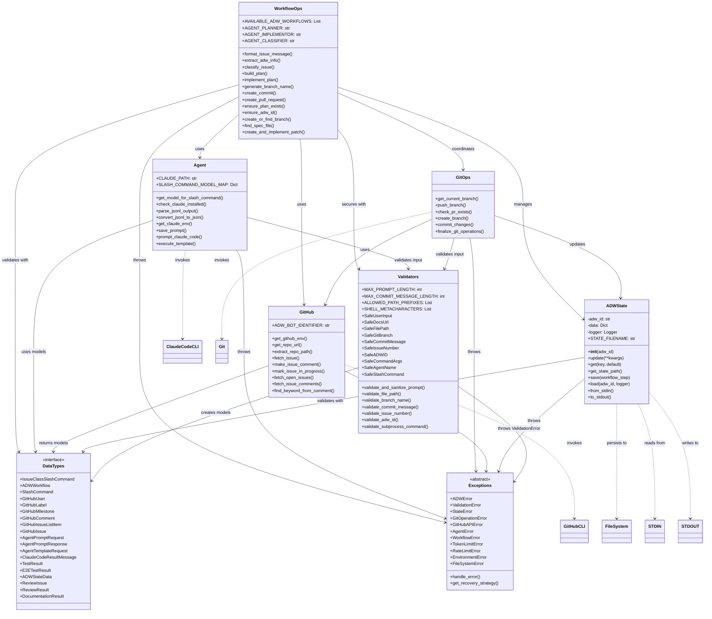

# Component Interaction UML Diagram

## ADW Module Architecture and Data Flow

This document presents a comprehensive UML class/component diagram showing the ADW (AI Developer Workflow) module relationships, state management, and data flow patterns with emphasis on Pydantic validation and security improvements.

## Complete System Component Diagram



## Module-by-Module Breakdown

### 1. WorkflowOps (workflow_ops.py)
**Purpose**: Core workflow orchestration and coordination

**Key Responsibilities**:
- Orchestrates multi-step workflows (plan, build, test, review, document)
- Manages agent invocations through Agent module
- Coordinates git operations through GitOps
- Ensures state persistence through ADWState
- Validates all inputs using Validators

**Security Features**:
- All user inputs validated with Pydantic models before processing
- ADW ID validation prevents injection attacks
- Sanitized commit messages and branch names
- Path traversal prevention in file operations

### 2. ADWState (state.py)
**Purpose**: Persistent state management across workflow steps

**Key Features**:
- File-based persistence in `agents/{adw_id}/adw_state.json`
- Transient state passing via stdin/stdout for piping
- Minimal core fields: adw_id, issue_number, branch_name, plan_file, issue_class
- Pydantic validation with ADWStateData model

**State Flow**:
```
Create → Save to File → Load from File → Update → Save Again
         ↓                ↑
      JSON File      STDIN/STDOUT
```

### 3. Agent (agent.py)
**Purpose**: Claude Code CLI invocation and response parsing

**Key Features**:
- Model selection mapping for optimal performance
- JSONL output parsing and conversion
- Environment variable safety (only required vars passed)
- Session tracking and error handling
- Automatic prompt saving for debugging

**Invocation Pattern**:
```
AgentTemplateRequest → execute_template() → prompt_claude_code() → Claude CLI
                                                                          ↓
AgentPromptResponse ← parse_jsonl_output() ← JSONL Output ← ─────────────┘
```

### 4. GitOps (git_ops.py)
**Purpose**: Safe git operations with validation

**Security Features**:
- Branch name validation prevents command injection
- Commit message sanitization
- Safe subprocess execution
- Automatic PR creation/update

**Operation Flow**:
```
validate_input → execute_git_command → check_result → update_state
```

### 5. GitHub (github.py)
**Purpose**: GitHub API and CLI integration

**Key Features**:
- Issue fetching with full metadata
- Comment posting with bot identifier
- PR management
- Environment-aware token handling

**Bot Loop Prevention**:
- All comments include `[ADW-BOT]` identifier
- Bot comments are filtered from processing

### 6. DataTypes (data_types.py)
**Purpose**: Pydantic models for type safety and validation

**Model Categories**:
- **GitHub Models**: GitHubIssue, GitHubComment, GitHubUser, etc.
- **Agent Models**: AgentPromptRequest, AgentPromptResponse, etc.
- **Workflow Models**: ADWStateData, ReviewResult, TestResult, etc.
- **Type Literals**: IssueClassSlashCommand, ADWWorkflow, SlashCommand

**Validation Chain**:
```
Raw Input → Pydantic Model → Validated Data → Business Logic
```

### 7. Validators (validators.py)
**Purpose**: Comprehensive input validation for security

**Security Measures**:
- **Length Limits**: Prevent DoS attacks (100KB prompt max)
- **Character Whitelisting**: Only allow safe characters in identifiers
- **Path Traversal Prevention**: Block `..` and dangerous prefixes
- **Shell Injection Prevention**: Detect and block metacharacters
- **Command Whitelisting**: Only allow known slash commands

**Validation Pattern**:
```python
# Example validation flow
user_input → SafeUserInput → validate_prompt() → sanitized_input
file_path → SafeFilePath → validate_path_safety() → safe_path
branch_name → SafeGitBranch → validate_branch_name() → valid_branch
```

### 8. Exceptions (exceptions.py)
**Purpose**: Structured error handling with recovery strategies

**Exception Hierarchy**:
```
ADWError (Base)
├── ValidationError (Input failures)
├── StateError (State management issues)
├── GitOperationError (Git command failures)
├── GitHubAPIError (GitHub API/CLI failures)
├── AgentError (Claude invocation failures)
├── WorkflowError (Workflow coordination failures)
├── TokenLimitError (API token limits)
├── RateLimitError (API rate limits)
├── EnvironmentError (Config/tool issues)
└── FileSystemError (File operations)
```

**Error Handling Pattern**:
```python
try:
    operation()
except SpecificError as e:
    handle_error(e, logger, issue_number, adw_id)
    recovery_strategy = get_recovery_strategy(e)
    # Apply recovery or fail gracefully
```

## Interaction Patterns

### 1. Workflow Execution Pattern
```
User Request → WorkflowOps.classify_issue()
    ↓
    ├→ Validators.validate_inputs()
    ├→ Agent.execute_template()
    ├→ ADWState.save()
    └→ GitHub.make_issue_comment()
```

### 2. State Persistence Pattern
```
Operation Start → ADWState.load() or new ADWState()
    ↓
    ├→ Update state during operations
    ├→ ADWState.save() after each step
    └→ ADWState.to_stdout() for piping
```

### 3. Agent Invocation Pattern
```
WorkflowOps → AgentTemplateRequest (Pydantic validated)
    ↓
    Agent.execute_template()
    ↓
    ├→ Agent.save_prompt()
    ├→ Agent.prompt_claude_code()
    ├→ Parse JSONL output
    └→ Return AgentPromptResponse
```

### 4. Git Coordination Pattern
```
WorkflowOps.create_or_find_branch()
    ↓
    ├→ Check ADWState for existing branch
    ├→ GitOps.create_branch() if needed
    ├→ GitOps.commit_changes()
    └→ GitOps.finalize_git_operations()
        ├→ push_branch()
        └→ create_pull_request()
```

## Security and Validation Highlights

### Input Validation Chain
Every external input passes through multiple validation layers:

1. **Pydantic Model Validation**: Type checking and basic constraints
2. **Field Validators**: Custom validation logic per field
3. **Security Validators**: Path traversal, injection prevention
4. **Business Logic Validation**: Workflow-specific rules

### Key Security Improvements

1. **Command Injection Prevention**:
   - All subprocess commands use validated arguments
   - Shell metacharacters detected and blocked
   - Whitelist-based command validation

2. **Path Traversal Prevention**:
   - Paths normalized and checked for `..`
   - Dangerous system directories blocked
   - Prefix whitelist enforcement

3. **DoS Prevention**:
   - Input length limits on all text fields
   - Token limit handling with graceful degradation
   - Rate limiting with exponential backoff

4. **Data Integrity**:
   - Pydantic models ensure type safety
   - State validation on save/load
   - Atomic operations with rollback capability

## State Management and Recovery

### State Lifecycle
```
1. Initialize: Create ADWState with unique adw_id
2. Persist: Save to agents/{adw_id}/adw_state.json
3. Load: Retrieve state for workflow continuation
4. Update: Modify state as workflow progresses
5. Finalize: Complete state with results
```

### Recovery Mechanisms

1. **State Recovery**:
   - Automatic state loading from file
   - Fallback to git history reconstruction
   - Stdin/stdout piping for transient state

2. **Error Recovery**:
   - Structured exceptions with context
   - Recovery strategies per error type
   - Automatic GitHub issue commenting

3. **Workflow Recovery**:
   - Checkpointing at each step
   - Resume from last successful state
   - Rollback capability for git operations

## Performance Considerations

### Parallel Execution Support
The architecture supports parallel execution through:
- Independent agent invocations
- Non-blocking state updates
- Subprocess parallelization (Test + Review + Document)

### Token Optimization
- Model selection based on task complexity
- Chunking for large inputs
- Minimal payload for GitHub operations

### Caching Strategies
- State file caching reduces repeated reads
- Environment variable caching
- Git command output caching

## Future Enhancement Opportunities

1. **Async/Await Pattern**: Convert to async for better concurrency
2. **Event-Driven Architecture**: Pub/sub for workflow events
3. **Distributed State**: Redis/database for multi-instance support
4. **Metrics Collection**: Performance and error tracking
5. **Circuit Breaker Pattern**: Automatic failure recovery
6. **Workflow Versioning**: Support multiple workflow versions

## Conclusion

The ADW module architecture demonstrates a well-structured, security-conscious design with:
- **Clear separation of concerns** across modules
- **Comprehensive validation** at every input point
- **Robust error handling** with recovery strategies
- **State persistence** for workflow continuity
- **Security hardening** through Pydantic validation

The modular design enables easy extension and modification while maintaining system integrity and security.