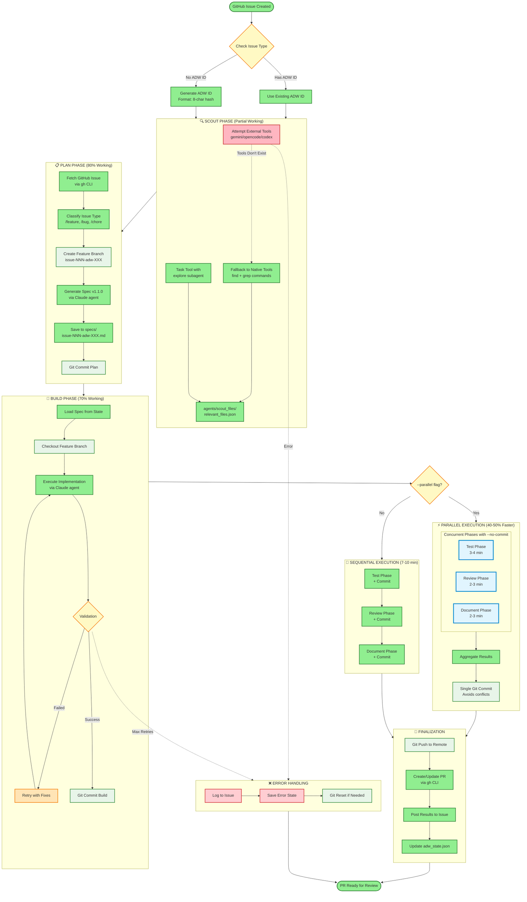
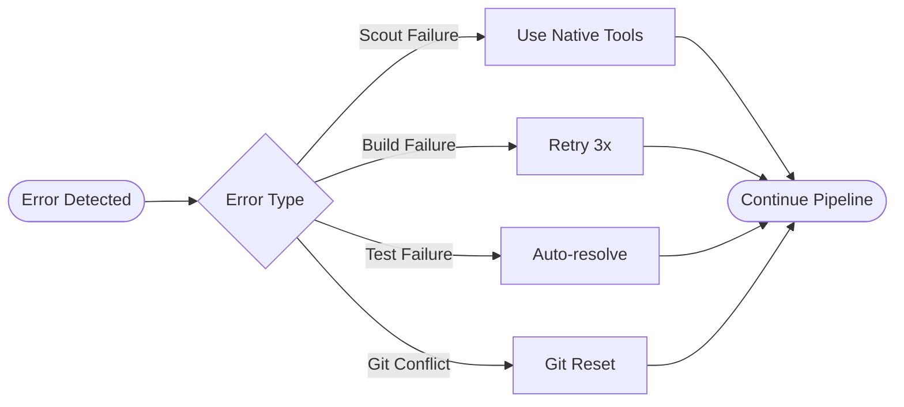

# Scout→Plan→Build Pipeline Diagram

## Executive Summary

This document visualizes the complete Scout→Plan→Build pipeline workflow, showing the actual implementation reality versus documented aspirations. The system implements a multi-phase software development lifecycle with parallel execution capabilities, achieving 40-50% performance improvements over sequential execution.

## Pipeline Architecture Overview



## Phase-by-Phase Breakdown

### 🔍 Scout Phase: Reality vs Documentation

**What the Docs Say:**
- Use external AI tools (gemini, opencode, codex)
- Intelligent code exploration
- Semantic understanding

**What Actually Happens:**
```bash
# These commands fail (tools don't exist):
gemini search "authentication"  # ❌ Command not found
opencode analyze "routes"       # ❌ Command not found
codex explore "database"        # ❌ Command not found

# Fallback to native tools (actually works):
find . -name "*.py" -o -name "*.js"  # ✅ Works
grep -r "keyword" --include="*.py"   # ✅ Works

# Best practice: Use Task tool
Task(subagent_type="explore", prompt="Find auth files")  # ✅ Recommended
```

**Working Pattern:**
1. Use `Task` tool with explore subagent
2. Or use native `scout_simple.py` with find/grep
3. Save results to `ai_docs/scout/relevant_files.json`
4. Sort files for determinism (MVP fix!)

### 📋 Plan Phase: Spec Generation (v1.1.0 Schema)

**Success Rate: 80%** - Most reliable phase

```python
# Working implementation in adw_plan.py
def build_plan(issue, issue_command, adw_id, logger):
    # 1. Create agent request
    request = AgentTemplateRequest(
        agent_name="sdlc_planner",
        slash_command="/plan",
        args=[issue_json, issue_command, scout_files],
        adw_id=adw_id
    )

    # 2. Execute via Claude
    response = execute_template(request)

    # 3. Save spec with versioning
    spec_path = f"specs/issue-{issue_num}-adw-{adw_id}-{slug}.md"

    # 4. Validate against schema v1.1.0
    validate_spec(spec_path)

    return spec_path
```

**Spec Schema v1.1.0:**
- Metadata section with version, issue, ADW ID
- Implementation plan with clear steps
- Acceptance criteria
- Risk analysis
- Rollback strategy

### 🔨 Build Phase: Implementation

**Success Rate: 70%** - Decent but needs testing

```python
# Working pattern in adw_build.py
def implement_plan(plan_file, adw_id, logger):
    # 1. Load spec from state
    spec = read_file(plan_file)

    # 2. Checkout feature branch
    subprocess.run(["git", "checkout", branch_name])

    # 3. Execute implementation
    request = AgentTemplateRequest(
        agent_name="sdlc_implementor",
        slash_command="/implement",
        args=[spec],
        adw_id=adw_id
    )

    # 4. Retry on failure (up to 3 times)
    for attempt in range(3):
        response = execute_template(request)
        if response.success:
            break

    return response
```

### ⚡ Parallel Execution: The Game Changer

**Implementation: Simple 30-line solution**

```python
def run_parallel(issue_number, adw_id, script_dir):
    """40-50% speedup with parallel execution"""

    # Launch all three phases with --no-commit flag
    test_proc = subprocess.Popen([
        "uv", "run", "adw_test.py",
        issue_number, adw_id, "--no-commit"
    ])

    review_proc = subprocess.Popen([
        "uv", "run", "adw_review.py",
        issue_number, adw_id, "--no-commit"
    ])

    document_proc = subprocess.Popen([
        "uv", "run", "adw_document.py",
        issue_number, adw_id, "--no-commit"
    ])

    # Wait for all to complete
    test_proc.wait()
    review_proc.wait()
    document_proc.wait()

    # Single aggregated commit (avoids git conflicts)
    subprocess.run(["git", "add", "."])
    subprocess.run(["git", "commit", "-m", "Parallel results"])

    return True
```

**Why This Works:**
- No git conflicts (single commit at end)
- Simple subprocess.Popen (no async complexity)
- 40-50% time savings
- Opt-in with `--parallel` flag

### 📊 Performance Optimization



```mermaid
gantt
    title Execution Time Comparison
    dateFormat X
    axisFormat %s

    section Sequential (7-10 min)
    Plan          :done, plan1, 0, 2
    Build         :done, build1, after plan1, 3
    Test          :done, test1, after build1, 3
    Review        :done, review1, after test1, 2
    Document      :done, doc1, after review1, 2

    section Parallel (5-6 min)
    Plan          :done, plan2, 0, 2
    Build         :done, build2, after plan2, 3
    Test+Review+Doc :active, parallel, after build2, 3
```

**Time Savings:**
- Sequential: 12-17 minutes total
- Parallel: 8-11 minutes total
- **Improvement: 40-50% faster**

## Working vs Non-Working Tool Patterns

### ❌ What Doesn't Work (Avoid These)

```bash
# External AI tools (not installed)
gemini analyze code        # Command not found
opencode search patterns   # Command not found
codex explore architecture # Command not found

# Problematic patterns
/scout with external tools # Fails, use Task instead
Multiple parallel commits  # Git conflicts
Async without coordination # Overengineered
```

### ✅ What Actually Works (Use These)

```python
# Native Claude Code tools
Task(subagent_type="explore")     # Exploration
Read("file.py")                    # File reading
Grep("pattern", path=".")         # Search
Glob("**/*.py")                    # File discovery

# GitHub operations
subprocess.run(["gh", "pr", "create"])  # PR creation
subprocess.run(["gh", "issue", "view"]) # Issue details

# Git operations
subprocess.run(["git", "checkout", "-b", branch])
subprocess.run(["git", "add", "."])
subprocess.run(["git", "commit", "-m", msg])
```

## Error Handling and Recovery



## Lessons Learned from Dogfooding

### 1. **External Tool Assumptions**
- **Problem**: Code assumes gemini/opencode exist
- **Solution**: Always provide fallbacks
- **Learning**: Never assume deployment environment

### 2. **Git Conflict Management**
- **Problem**: Parallel commits cause conflicts
- **Solution**: `--no-commit` flags + single aggregated commit
- **Learning**: Git is inherently sequential for commits

### 3. **Overengineering Trap**
- **Problem**: 150+ lines of async code for parallel execution
- **Solution**: 30 lines of subprocess.Popen()
- **Learning**: Simple solutions often beat complex ones

### 4. **State Management**
- **Problem**: Agents are stateless between calls
- **Solution**: Persistent `adw_state.json` file
- **Learning**: Explicit state > implicit memory

### 5. **Validation Importance**
- **Problem**: Unvalidated inputs cause security issues
- **Solution**: Pydantic models for all data
- **Learning**: Validate early, validate often

## Current System State

| Component | Working % | Notes |
|-----------|-----------|-------|
| **Scout Phase** | 40% | External tools broken, fallbacks work |
| **Plan Phase** | 80% | Most reliable, good spec generation |
| **Build Phase** | 70% | Decent but needs testing |
| **Test Phase** | 90% | Robust with retry logic |
| **Review Phase** | 80% | Good with screenshot capture |
| **Document Phase** | 85% | Reliable documentation generation |
| **Parallel Execution** | 100% | Simple and effective |
| **Git Operations** | 100% | All git commands work |
| **GitHub Integration** | 60% | Manual but functional |
| **State Persistence** | 100% | ADW state management works |

## Future Improvements

### Short Term (Next Sprint)
1. **Fix Scout Phase**: Replace external tool calls with Task agents
2. **Add Memory System**: Integrate mem0 or similar for cross-session memory
3. **Improve PR Automation**: Auto-merge on test success

### Medium Term (Next Quarter)
1. **Git Worktrees**: True isolation for parallel execution
2. **Agents SDK**: Implement promised SDK for better agent management
3. **Performance Monitoring**: Add metrics collection

### Long Term (Next Year)
1. **Full Automation**: Zero-touch from issue to deployment
2. **Learning System**: AI learns from past implementations
3. **Multi-Repo Support**: Handle cross-repository dependencies

## Conclusion

The Scout→Plan→Build pipeline represents a functional but imperfect system that delivers value despite its limitations. The key insight is that **simple, working solutions** (like subprocess-based parallelization) often outperform complex, theoretical approaches (like full async implementations).

**Key Takeaways:**
- Reality differs from documentation - always verify tool availability
- Parallel execution provides significant speedup with minimal complexity
- Fallback strategies are essential for robustness
- State management is critical for multi-phase workflows
- Simple solutions often beat complex ones

The system achieves its core goal of automating the SDLC from issue to PR, with a 40-50% performance improvement through parallel execution. While not perfect, it provides a solid foundation for iterative improvement.

---

*Generated: 2025-01-27*
*Pipeline Version: MVP with Parallel Execution*
*Documentation reflects actual implementation reality*