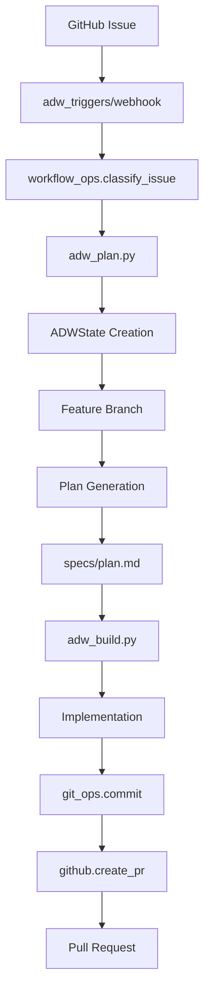

# Scout Plan Build MVP - Comprehensive Repository Reference

*Generated: 2025-01-20 | Purpose: Structured reference documentation for agent consumption*

## 🏗️ Repository Architecture Overview

```
scout_plan_build_mvp/
├── adws/                    # Agentic Development Workflow system (28 Python files, ~5,873 LOC)
├── agents/                  # Agent workspaces and scout outputs
├── ai_docs/                 # Generated documentation and reports
├── specs/                   # Implementation plans from plan phase
├── logs/                    # Session logs and tool invocations
├── .claude/                 # Claude Code commands and hooks
├── docs/                    # Core documentation
└── scripts/                 # Utility scripts
```

## 📊 Core Metrics

- **Total Python Files**: 28
- **Lines of Code**: ~5,873
- **Pydantic Models**: 22 (in data_types.py + health_check.py)
- **Slash Commands**: 46 total (31 in .claude/commands/, 15 in ADW system)
- **Workflows**: 10 variants (plan, build, test, review, document, patch + 4 orchestrators)
- **External Dependencies**: GitHub API, Claude Code CLI, Git, UV

## 🔄 Data Flow: GitHub Issue → Pull Request



## 🎯 ADWState Management Pattern

```python
# Core state flow through pipeline
class ADWState:
    adw_id: str              # 8-char unique ID
    issue_number: int        # GitHub issue
    branch_name: str         # feature/issue-N-adw-ID
    plan_file: str           # specs/issue-N-adw-ID-*.md
    issue_class: str         # bug/feature/chore

    # Persistence: agents/{adw_id}/adw_state.json
    # Each phase loads → modifies → saves state
```

## 📂 Key Components Analysis

### 1. ADW Modules (`adws/adw_modules/`)

| Module | Purpose | Key Functions | Lines |
|--------|---------|---------------|-------|
| **workflow_ops.py** | Core orchestration | classify_issue, build_plan, implement_plan | 654 |
| **state.py** | State persistence | ADWState class, save/load | 142 |
| **agent.py** | Claude CLI integration | prompt_claude_code, execute_template | 329 |
| **github.py** | GitHub API | fetch_issue, create_pr, post_comment | 423 |
| **git_ops.py** | Git operations | create_branch, commit_changes | 158 |
| **data_types.py** | Pydantic models | 22 model classes | 238 |
| **utils.py** | Logging setup | setup_logger, get_logger | 89 |
| **r2_uploader.py** | Screenshot upload | upload_to_r2 | 189 |

### 2. Workflow Scripts (`adws/adw_*.py`)

| Script | Purpose | Inputs | Outputs |
|--------|---------|--------|---------|
| **adw_plan.py** | Generate plan | issue_number, adw_id | specs/plan.md |
| **adw_build.py** | Implement plan | plan_file | git commits |
| **adw_test.py** | Run tests | adw_id | test results |
| **adw_review.py** | Code review | adw_id | review report |
| **adw_document.py** | Generate docs | adw_id | documentation |
| **adw_patch.py** | Direct patch | issue_number | patch file |

### 3. Orchestrators (Composable Pipelines)

```python
# adw_plan_build.py
plan() -> build()

# adw_plan_build_test.py
plan() -> build() -> test()

# adw_plan_build_test_review.py
plan() -> build() -> test() -> review()

# adw_sdlc.py (complete)
plan() -> build() -> test() -> review() -> document()
```

## 🛡️ Safety & Security Patterns

### Git Safety
```python
# Always check before operations
git diff --stat
git reset --hard  # If changes detected
```

### Input Validation (Pydantic)
```python
class GitHubIssue(BaseModel):
    number: int
    title: str
    body: str
    # Field validation automatic
```

### Subprocess Safety
```python
# No shell=True, use list args
subprocess.run(['git', 'commit', '-m', message])
```

### Timeout Enforcement
- Subagents: 3 minutes
- Claude Code: 5 minutes (default)
- No infinite loops

## 📝 Command Architecture

### Scout Command Evolution
| Aspect | Original | Improved |
|--------|----------|----------|
| **Parallelism** | Implicit | Explicit Task tool |
| **Output** | Text list | JSON schema |
| **Timeout** | Mentioned | 3-min enforced |
| **Safety** | Basic | Git reset after |

### Agent Spawning Pattern
```
/scout "prompt" "4"
  ├─ Task → Bash → gemini-g
  ├─ Task → Bash → opencode
  ├─ Task → Bash → claude-g
  └─ Task → Bash → codex
     └─ Aggregate → scout_outputs/relevant_files.json
```

## 🚨 Engineering Gaps Identified

### 1. **Type Coverage** (~60% estimated)
- ✅ Pydantic in data_types.py (22 models)
- ⚠️ Missing type hints in workflow_ops.py
- ❌ No typing in test files

### 2. **Test Coverage** (~30% estimated)
- ✅ Basic health checks
- ⚠️ Limited integration tests
- ❌ No tests for state.py, git_ops.py

### 3. **Error Handling**
- ✅ Try/except in main flows
- ⚠️ Generic exceptions mask issues
- ❌ No structured error types

### 4. **Performance**
- ❌ No parallelization in workflows
- ❌ Sequential subprocess calls
- ❌ No caching mechanisms

### 5. **Security**
- ✅ No hardcoded secrets
- ⚠️ Subprocess input not sanitized
- ❌ No rate limiting

## 🔧 Slug/ID Generation

```python
# ADW ID: 8-character random
adw_id = ''.join(random.choices(string.ascii_lowercase + string.digits, k=8))

# Branch naming
branch = f"feature/issue-{issue_number}-adw-{adw_id}"

# Plan file naming
plan_file = f"specs/issue-{issue_number}-adw-{adw_id}-{slugify(title)}.md"

# Slugify function
def slugify(text):
    return re.sub(r'[^a-z0-9]+', '-', text.lower()).strip('-')
```

## 📋 Best Practices Observed

1. **State Persistence**: JSON files in `agents/{adw_id}/`
2. **Atomic Commits**: Each operation = separate commit
3. **Validation Gates**: Check requirements before proceeding
4. **Structured Output**: JSON for data, Markdown for docs
5. **Timeout Limits**: Prevent infinite operations
6. **Git Safety**: Always verify clean state

## 🚀 Quick Start for Agents

### To Scout Files
```python
# Use /scout command
relevant_files = "/scout 'task description' '4'"
# Returns: scout_outputs/relevant_files.json
```

### To Generate Plan
```python
# Use /plan_w_docs
plan = "/plan_w_docs 'task' 'docs_url' 'relevant_files.json'"
# Returns: specs/plan.md
```

### To Build
```python
# Use /build_adw
report = "/build_adw 'specs/plan.md'"
# Returns: ai_docs/build_reports/report.md
```

## 📈 Recommendations for Enhancement

### Immediate (Ship Fast)
1. Add Pydantic to workflow_ops.py functions
2. Implement structured error types
3. Add basic retry logic for API calls
4. Create integration test suite

### Short-term (Polish)
1. Parallelize independent operations
2. Add caching for expensive calls
3. Implement rate limiting
4. Enhance type coverage to 90%

### Long-term (Scale)
1. Move to async/await pattern
2. Implement workflow DAG engine
3. Add observability (metrics, traces)
4. Create plugin architecture

## 🔐 Security Considerations

### Current Protections
- Environment variables for secrets
- No shell=True in subprocess
- Pydantic validation on inputs
- Git hooks for dangerous commands

### Recommended Additions
```python
# Input sanitization
import shlex
safe_arg = shlex.quote(user_input)

# Rate limiting
from functools import lru_cache
@lru_cache(maxsize=100)
def expensive_operation():
    pass

# Structured errors
class ADWError(Exception):
    pass
class ValidationError(ADWError):
    pass
```

---

*This reference document provides a comprehensive overview suitable for agent ingestion and understanding. Use it as a foundation for deeper analysis and implementation decisions.*