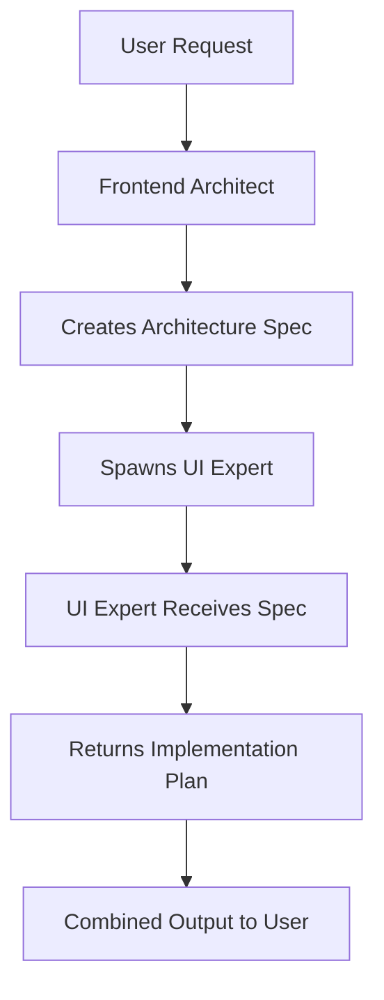

# Shadcn Agent Interactions Guide

## Overview

Two specialized agents work together to handle frontend architecture and UI implementation:

- **shadcn-frontend-architect** (Opus 4.1) - System architecture, planning, data flow
- **shadcn-ui-expert** (Sonnet 4.5) - Component implementation, styling, accessibility

---

## Quick Reference

| Agent | Model | Focus | Output |
|-------|-------|-------|--------|
| **Frontend Architect** | claude-opus-4-1 | Architecture & Planning | Specs, ADRs, diagrams |
| **UI Expert** | claude-sonnet-4.5 | Implementation Details | Component configs, Tailwind classes |

---

## Real-World Interaction Examples

### Example 1: Building a Data Management Dashboard

**User Request**: "I need a dashboard to manage product data with filtering and bulk operations"

**Flow**:


**Architect Output**:
```markdown
## Dashboard Architecture

### Component Hierarchy
- DashboardLayout (shell)
  - HeaderBar (navigation, user info)
  - SidePanel (filters, bulk actions)
  - MainContent
    - DataTable (product grid)
    - Pagination
    - BulkActionBar

### Data Flow
- Global state: Zustand store for filters
- Server state: React Query for product data
- Local state: Row selection in DataTable

### Performance Requirements
- Virtual scrolling for 10k+ products
- Debounced filter inputs (300ms)
- Optimistic updates for bulk operations
```

**UI Expert Output** (after receiving spec):
```markdown
## Implementation Plan

### Components Selection
- DashboardLayout: Custom with CSS Grid
  ```css
  grid-template-areas:
    "header header"
    "sidebar main";
  ```
- DataTable: shadcn/ui Table + tanstack/react-table
  - Props: `columns`, `data`, `enableRowSelection`
  - Variants: `variant="striped"`, `size="sm"`
- Filters:
  - SearchInput with `Command` component
  - MultiSelect using `Popover` + `Command`
  - DateRangePicker using `Popover` + `Calendar`

### Accessibility
- aria-label="Product management dashboard"
- role="main" on data table container
- Keyboard navigation: Tab through filters, arrows in table
```

---

### Example 2: UI Expert Needs Architecture

**User to UI Expert**: "Create a multi-step checkout form"

**UI Expert Response**:
```markdown
I need to understand the checkout flow architecture first.
Let me request this from the Frontend Architect.
```

**UI Expert spawns Architect**:
```javascript
Task({
  subagent_type: "shadcn-frontend-architect",
  prompt: "Design architecture for multi-step checkout: cart review, shipping, payment, confirmation"
})
```

**Architect Returns**:
```markdown
## Checkout Flow Architecture

### State Machine
Cart → Shipping → Payment → Confirmation
- Back navigation allowed until Payment submission
- Progress indicator shows current step

### Data Persistence
- Local storage for incomplete checkouts
- Session recovery on refresh
```

**UI Expert Then Provides**:
```markdown
## Checkout Implementation

### Components
- Stepper: Custom using shadcn/ui Progress
- Forms: react-hook-form + zod validation
- CartStep: Card components with product images
- ShippingStep: Form with AddressAutocomplete
- PaymentStep: Secure iframe integration
```

---

### Example 3: Parallel Work with Scout-Plan-Build

**User**: "Implement the refinery data cleaning interface from docs/INVARIANTS.md"

**Framework Orchestration**:
```bash
# Framework splits work between agents

# Parallel execution:
Thread 1: shadcn-frontend-architect
  - Scouts existing structure
  - Designs component hierarchy
  - Plans data flow for patches

Thread 2: shadcn-ui-expert
  - Scouts UI patterns in codebase
  - Identifies reusable components
  - Plans filter UI components

# Convergence:
- Both outputs merge in specs/
- Framework builds consolidated solution
```

---

## Boundary Violation Handling

### Scenario 1: Architect Asked About Tailwind

**User to Architect**: "What Tailwind classes should I use for the sidebar?"

**Architect Response**:
```markdown
I focus on architecture and structure. For specific Tailwind classes,
I'll delegate this to the shadcn-ui-expert who handles styling details.

[Spawns UI Expert with context about sidebar requirements]
```

### Scenario 2: UI Expert Asked About State Management

**User to UI Expert**: "Should I use Context or Zustand for the filters?"

**UI Expert Response**:
```markdown
State management architecture is beyond my UI implementation scope.
Let me get an architectural decision from shadcn-frontend-architect.

[Spawns Architect to decide state management approach]
```

---

## Using with Scout-Plan-Build Framework

### Method 1: Natural Language
```
"Design and implement a product catalog with filters"

Framework automatically:
1. Spawns Architect for structure
2. Spawns UI Expert for implementation
3. Combines outputs
```

### Method 2: Explicit Commands
```bash
# Architecture phase
/plan_w_docs "Design catalog architecture" "docs/requirements.md"
# → Uses shadcn-frontend-architect

# Implementation phase
/build_adw "specs/catalog-ui.md"
# → Uses shadcn-ui-expert
```

### Method 3: Direct Agent Invocation
```javascript
// In your code or Claude Code
Task({
  subagent_type: "shadcn-frontend-architect",
  prompt: "Design the catalog structure"
})

Task({
  subagent_type: "shadcn-ui-expert",
  prompt: "Implement the catalog UI from this spec: ..."
})
```

---

## Best Practices

### DO ✅

1. **Let agents delegate to each other** - They know their boundaries
2. **Use shared conventions** - Both reference `.claude/agents/shared-conventions.md`
3. **Trust the handoff** - Architect → UI Expert flow is optimized
4. **Provide context** - Share requirements, constraints, existing code
5. **Use the framework** - Scout-Plan-Build orchestrates both agents well

### DON'T ❌

1. **Don't force wrong agent** - Let them redirect if needed
2. **Don't skip architecture** - UI Expert needs structure to implement
3. **Don't mix responsibilities** - Keep architecture and implementation separate
4. **Don't override delegation** - Trust their collaboration patterns
5. **Don't bypass framework** - It handles orchestration efficiently

---

## Common Workflows

### New Feature Development
```
1. User describes feature need
2. Architect designs structure (or is auto-spawned)
3. Architect spawns UI Expert with spec
4. UI Expert provides implementation details
5. User receives complete solution
```

### Refactoring Existing Code
```
1. User requests refactoring
2. Both agents scout in parallel
3. Architect redesigns structure
4. UI Expert updates implementation
5. Coordinated output delivered
```

### Bug Fixes
```
1. User reports UI issue
2. UI Expert investigates
3. If architectural: spawns Architect
4. If implementation: fixes directly
5. Solution provided
```

---

## Integration Points

### Shared Resources
- `/plans/architecture/` - Architect outputs
- `/plans/implementation/` - UI Expert outputs
- `.claude/agents/shared-conventions.md` - Common terminology
- `specs/` - Scout-Plan-Build specifications
- `ai_docs/` - Build reports and documentation

### Communication Protocol
```typescript
interface HandoffSpec {
  from: "architect" | "ui-expert";
  to: "architect" | "ui-expert";
  context: {
    requirements: string;
    constraints: string[];
    existingPatterns?: string[];
  };
  requestType: "design" | "implement" | "validate";
}
```

---

## Troubleshooting

### "Agents keep delegating back and forth"
- Check if requirements are clear
- Ensure architectural decisions exist before UI work
- Review shared conventions for conflicts

### "Agent doing wrong type of work"
- They self-correct via boundary detection
- Will auto-delegate to correct agent
- Check agent names in Task tool calls

### "Outputs don't align"
- Verify both reference shared conventions
- Check handoff specifications
- Ensure framework orchestration is enabled

---

## Questions You Might Have

**Q: What if I only want one agent?**
A: Specify the agent directly with Task tool. They'll delegate if needed.

**Q: Can they work simultaneously?**
A: Yes! Scout-Plan-Build framework enables parallel execution when tasks are independent.

**Q: How do they handle conflicts?**
A: Shared conventions define resolution order: User > Docs > Architecture > Implementation

**Q: Do they share memory/context?**
A: Through shared file outputs and explicit handoff specs, not direct memory.

---

*Last Updated: 2024-11-17*
*Framework: Scout-Plan-Build v2024.11.8*
*Agents: shadcn-frontend-architect (Opus 4.1), shadcn-ui-expert (Sonnet 4.5)*