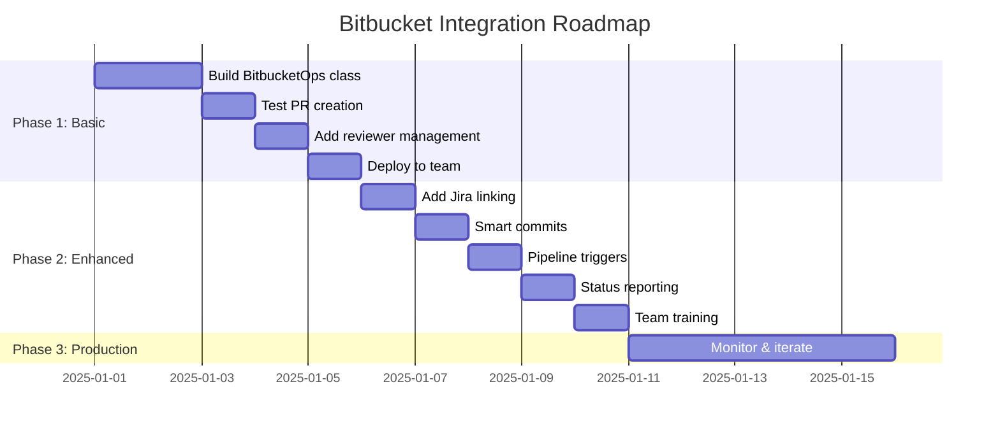

# Bitbucket Integration Plan
*Making the Framework Work with Your Team's Workflow*

---

## Implementation Timeline



---

## 🚨 Current Reality: 0% Bitbucket Support

The framework is **completely GitHub-centric**. Every script has hardcoded GitHub APIs, `gh` CLI commands, and GitHub-specific URL parsing.

## 🎯 What Bitbucket Integration Means

### Essential Features (Week 1)
- ✅ Create feature branches
- ✅ Push code changes
- ✅ Create pull requests
- ✅ Link to Jira issues

### Advanced Features (Week 2)
- ✅ Add reviewers automatically
- ✅ Set PR labels/components
- ✅ Trigger pipelines
- ✅ Comment on PRs

## 🛠️ Immediate Workaround (Use Today)

Until we build native support, here's how to use the framework with Bitbucket:

### Step 1: Let Framework Build Locally
```
You: "Add user authentication feature"

Claude:
- Scouts files ✅
- Creates plan ✅
- Builds feature ✅
- Tests locally ✅
- (Skip GitHub PR) ⚠️
```

### Step 2: Manual Bitbucket Push
```bash
# After framework completes:
git checkout -b feature/user-auth
git add .
git commit -m "feat: user authentication"
git push origin feature/user-auth
```

### Step 3: Create PR via Bitbucket Web UI
1. Go to your Bitbucket repository
2. Click "Create pull request"
3. Copy description from `ai_docs/build_reports/`
4. Add reviewers
5. Submit

## 📦 Building Native Bitbucket Support

### Phase 1: Basic Integration (2 days)
```python
# adws/adw_modules/bitbucket_ops.py

class BitbucketOps:
    def __init__(self, workspace, repo, token):
        self.api_url = f"https://api.bitbucket.org/2.0"
        self.workspace = workspace
        self.repo = repo

    def create_pr(self, title, description, source_branch):
        """Create Bitbucket pull request"""
        # API implementation

    def add_reviewers(self, pr_id, reviewers):
        """Add default reviewers"""
        # API implementation
```

### Phase 2: Jira Integration (1 day)
```python
def link_jira_issue(self, pr_id, issue_key):
    """Link PR to Jira issue"""
    # Parse issue key from branch name
    # Add smart commit messages
    # Update Jira status
```

### Phase 3: Pipeline Integration (1 day)
```python
def trigger_pipeline(self, branch):
    """Trigger Bitbucket pipeline"""
    # Start build
    # Wait for results
    # Report status
```

## 🔄 Natural Language for Bitbucket

### What You'll Be Able to Say

#### Simple PR Creation
```
You: "Fix the login bug and create a Bitbucket PR"

Claude will:
1. Fix the bug
2. Create branch: bugfix/login-timeout
3. Push to Bitbucket
4. Create PR with description
5. Add your team as reviewers
```

#### With Jira Integration
```
You: "Implement PROJ-123 the user profile feature"

Claude will:
1. Build the feature
2. Create branch: feature/PROJ-123-user-profile
3. Push with smart commits
4. Create PR linked to PROJ-123
5. Move Jira ticket to "In Review"
```

#### With Pipeline Checks
```
You: "Add the API endpoint and wait for pipeline to pass"

Claude will:
1. Add the endpoint
2. Push to Bitbucket
3. Trigger pipeline
4. Wait for success
5. Create PR only if green
```

## 📝 Bitbucket Configuration

### Environment Variables Needed
```bash
# Add to your .bashrc or .zshrc
export BITBUCKET_WORKSPACE="your-team"
export BITBUCKET_REPO="your-repo"
export BITBUCKET_USERNAME="your-username"
export BITBUCKET_APP_PASSWORD="xxx-xxx-xxx"  # From Bitbucket settings
export JIRA_URL="https://your-team.atlassian.net"
export JIRA_EMAIL="your-email@company.com"
export JIRA_API_TOKEN="xxx-xxx-xxx"  # From Atlassian account
```

### Repository Setup
```yaml
# .bitbucket/config.yml
reviewers:
  default:
    - team-lead
    - senior-dev
  frontend:
    - ui-expert
  backend:
    - api-expert

pipelines:
  branches:
    feature/*:
      - step: test
      - step: build
    bugfix/*:
      - step: test
```

## 🚀 Migration Path from GitHub

### Week 1: Basic Functionality
```
Day 1-2: Build BitbucketOps class
Day 3: Test PR creation
Day 4: Add reviewer management
Day 5: Deploy to team
```

### Week 2: Enhanced Integration
```
Day 1: Add Jira linking
Day 2: Smart commits
Day 3: Pipeline triggers
Day 4: Status reporting
Day 5: Team training
```

## 💡 Using Framework for Bitbucket Development

### Step 1: Build the Integration
```
You: "Create Bitbucket integration module for the framework"

Claude: Creates adws/adw_modules/bitbucket_ops.py
```

### Step 2: Test with Mock API
```
You: "Add tests for Bitbucket PR creation"

Claude: Creates tests/test_bitbucket_ops.py
```

### Step 3: Integrate with Workflows
```
You: "Modify adw_sdlc.py to use Bitbucket instead of GitHub"

Claude: Updates all GitHub references to use Bitbucket
```

## ⚙️ Technical Details (Hidden from Users)

### API Endpoints We'll Use
```
POST /repositories/{workspace}/{repo}/pullrequests
POST /repositories/{workspace}/{repo}/pullrequests/{id}/reviewers
GET  /repositories/{workspace}/{repo}/pullrequests/{id}/statuses
POST /repositories/{workspace}/{repo}/pipelines
```

### Branch Naming Convention
```python
def create_branch_name(issue_type, issue_key, description):
    """Bitbucket-friendly branch names"""
    if issue_key:
        return f"{issue_type}/{issue_key}-{slugify(description)}"
    return f"{issue_type}/{slugify(description)}"
```

### PR Description Template
```markdown
## Summary
{auto-generated summary}

## Changes
{list of modified files}

## Testing
{test results}

## Jira
{issue_key}: {issue_title}

---
Generated by Scout-Plan-Build Framework
```

## 📊 Success Metrics

### Phase 1 Success (Basic)
- [ ] Can create branches programmatically
- [ ] Can push to Bitbucket
- [ ] Can create simple PRs
- [ ] Team can review and merge

### Phase 2 Success (Integrated)
- [ ] Jira tickets auto-linked
- [ ] Reviewers auto-assigned
- [ ] Pipelines triggered
- [ ] Status reported back

### Phase 3 Success (Seamless)
- [ ] Natural language "just works"
- [ ] No manual steps needed
- [ ] Team fully adopted
- [ ] 50% reduction in PR creation time

## 🆘 Troubleshooting Bitbucket

### "Can't authenticate"
```bash
# Test your credentials:
curl -u username:app-password \
  https://api.bitbucket.org/2.0/user
```

### "Can't create PR"
```bash
# Check repository access:
curl -u username:app-password \
  https://api.bitbucket.org/2.0/repositories/workspace/repo
```

### "Jira not linking"
```
# Ensure smart commits enabled in Bitbucket settings
# Branch must contain issue key: feature/PROJ-123-description
```

## ✅ Action Items

### For You (This Week)
1. Provide Bitbucket credentials for testing
2. Share repository structure
3. List default reviewers
4. Explain team's PR conventions

### For Claude (This Week)
1. Build BitbucketOps module
2. Test with mock API
3. Integrate with existing workflows
4. Create migration script

### For Team (Next Week)
1. Test Bitbucket integration
2. Provide feedback
3. Customize for workflow
4. Roll out to everyone

## 🎯 End Goal

In 2 weeks, your team should be able to say:

```
"Implement PROJ-456 to add customer notifications"
```

And the framework will:
1. Build the feature
2. Create Bitbucket PR
3. Link to Jira PROJ-456
4. Add reviewers
5. Run pipelines
6. Update ticket status

**No GitHub. No manual steps. Just Bitbucket native.** 🚀