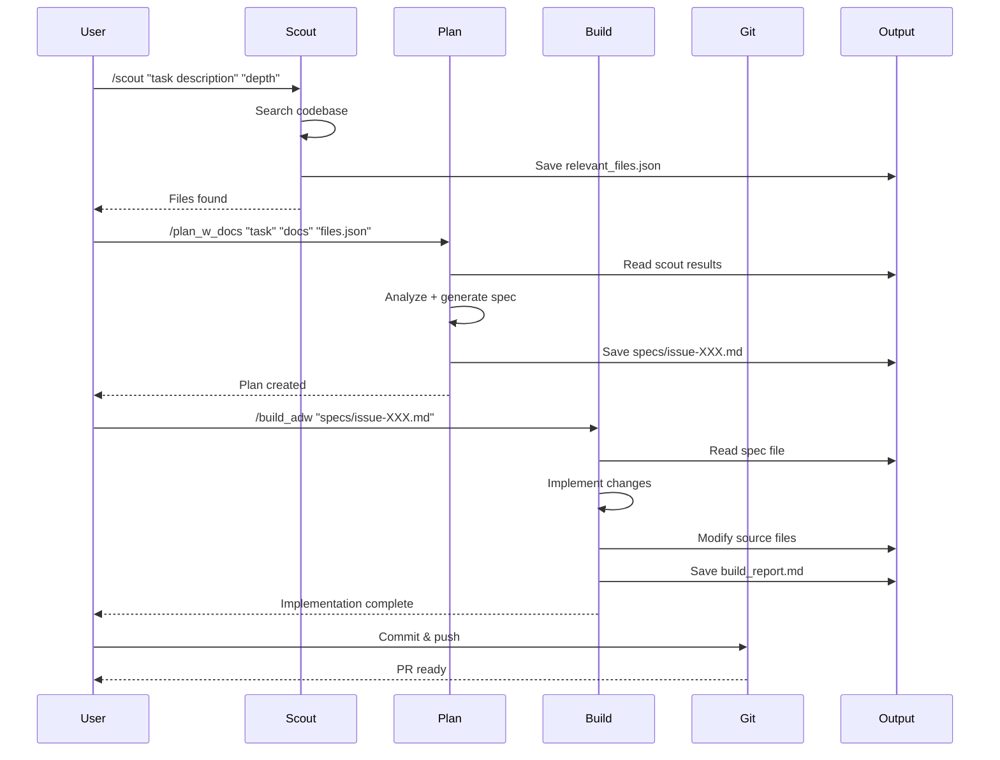

# SCOUT → PLAN → BUILD — Workflow

The end-to-end loop:

1. **Scout** — quickly search the repo, produce a *file list with line ranges* relevant to the prompt.
2. **Plan w/ Docs** — generate a thorough implementation plan that references documentation and the scouted files; save it under `specs/`.
3. **Build** — implement changes per the plan; produce a concise build report.

**Composition:** `/scout_plan_build` composes these three as nested slash commands (call `/scout` then `/plan_w_docs` then `/build`). This mirrors the video and Gemini summary.

---

## Workflow Sequence Diagram



---

## Directory Structure

```
project/
├── scout_outputs/           <- Scout saves here
│   └── relevant_files.json
├── specs/                   <- Plan saves here
│   └── issue-XXX-adw-YYY.md
└── ai_docs/
    └── build_reports/       <- Build saves here
        └── build-report.md
```
