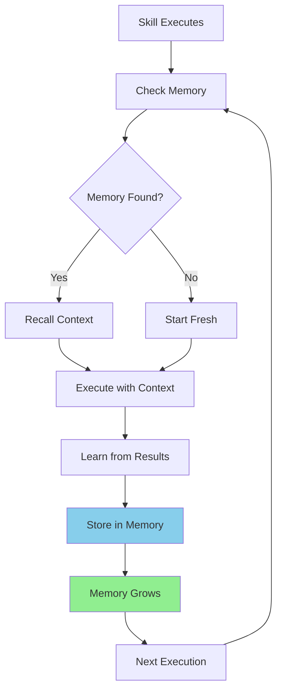

# 🧠 Skills and Memory Architecture - How It Actually Works

## 📁 Where Everything Lives

```
Your Project Directory Structure:
━━━━━━━━━━━━━━━━━━━━━━━━━━━━━━━━━━━━━━━━━━━━━━

scout_plan_build_mvp/
├── .claude/                    # Project-specific Claude config
│   ├── commands/               # Slash commands (current system)
│   │   ├── scout.md           # Individual command definitions
│   │   ├── plan_w_docs.md
│   │   └── build_adw.md
│   │
│   ├── skills/                 # Enhanced skills (NEW!)
│   │   ├── adw-scout.md       # Smart scout with memory
│   │   ├── adw-complete.md    # Full workflow skill
│   │   └── memory-recall.md   # Memory operations
│   │
│   └── memory/                 # Local memory storage
│       ├── mem0.db            # SQLite database for mem0
│       ├── embeddings/        # Vector embeddings cache
│       └── sessions.json      # Session history

~/.claude/                      # Global Claude config (user-wide)
├── commands/                   # Global slash commands
└── skills/                     # Global skills available everywhere
```

## 🔄 How Skills Grow Memories

### The Memory Lifecycle



### Memory Storage Layers

```python
# 1. IMMEDIATE MEMORY (Session)
# Stored in: .claude/memory/sessions.json
{
  "session_id": "abc123",
  "timestamp": "2024-01-20T10:00:00Z",
  "context": {
    "last_task": "add authentication",
    "files_found": ["auth.js", "middleware.js"],
    "patterns_used": ["Express middleware", "JWT"]
  }
}

# 2. SHORT-TERM MEMORY (Project)
# Stored in: .claude/memory/mem0.db (SQLite)
CREATE TABLE memories (
  id INTEGER PRIMARY KEY,
  task TEXT,
  patterns TEXT,
  files TEXT,
  confidence REAL,
  timestamp DATETIME,
  usage_count INTEGER
);

# 3. LONG-TERM MEMORY (Semantic)
# Stored in: .claude/memory/embeddings/
{
  "embedding_id": "emb_789",
  "vector": [0.23, -0.45, 0.67, ...],  # 1536 dimensions
  "metadata": {
    "task": "JWT implementation",
    "success_rate": 0.95,
    "pattern": "middleware-based auth"
  }
}

# 4. COLLECTIVE MEMORY (Cross-Project)
# Stored in: ~/.claude/global_memory/
# Shared across all projects for common patterns
```

## 🎯 What Skills Actually Look Like

### Anatomy of a Skill File

```markdown
---
# YAML Frontmatter - Skill Configuration
name: adw-scout                           # Unique identifier
description: Smart scout with memory      # One-line description
version: 1.0.0                            # Semantic versioning
author: system                            # Who created it
category: workflow                        # Category for organization
model: claude-sonnet-4-5-20250929        # Which model to use
max_thinking_tokens: 10000               # Allow deep thinking
temperature: 0.3                          # Lower = more deterministic
tools:                                    # Available tools
  - Read
  - Write
  - Grep
  - Glob
  - Task
mcp_servers:                             # MCP servers to activate
  - sequential-thinking                  # For analysis
  - mem0                                 # For memory
memory:                                   # Memory configuration
  enabled: true
  retention: 30d                         # Keep memories for 30 days
  confidence_threshold: 0.7              # Only use high-confidence memories
hooks:                                   # Event hooks
  pre_execute: check_memory
  post_execute: save_memory
  on_error: log_failure_pattern
---

# Skill Implementation (Markdown + Code)

## Memory Recall Phase
Check if we've done similar tasks before:
```python
similar_tasks = mem0.search(USER_PROMPT, limit=5)
if similar_tasks and similar_tasks[0].confidence > 0.7:
    previous_patterns = similar_tasks[0].data
    # Use these patterns as starting point
```

## Execution Phase
[Actual implementation logic here]

## Learning Phase
Save what we learned:
```python
mem0.add({
    "task": USER_PROMPT,
    "files_found": result.files,
    "patterns": extracted_patterns,
    "success": True
})
```
```

### How Memory Grows Over Time

```python
# First Execution (No Memory)
Task: "add user authentication"
Memory Before: {}
Execution:
  - Searches entire codebase
  - Takes 5 minutes
  - Finds 20 relevant files
Memory After: {
  "task": "add user authentication",
  "pattern": "auth files in src/auth/",
  "common_files": ["app.js", "routes/api.js"],
  "time_taken": 300
}

# Second Execution (With Memory)
Task: "add role-based authentication"
Memory Before: {
  "similar_task": "add user authentication",
  "confidence": 0.85,
  "learned_patterns": ["src/auth/", "middleware pattern"]
}
Execution:
  - Starts with src/auth/ directory
  - Takes 2 minutes (60% faster!)
  - Finds 25 relevant files (more comprehensive)
Memory After: {
  "task": "add role-based authentication",
  "refined_pattern": "auth + roles in src/auth/rbac/",
  "common_files": ["app.js", "routes/api.js", "models/user.js"],
  "relationship": "extends: add user authentication"
}

# Tenth Execution (Rich Memory)
Task: "add OAuth authentication"
Memory Before: {
  "authentication_patterns": {
    "basic": {"files": [...], "confidence": 0.95},
    "jwt": {"files": [...], "confidence": 0.92},
    "role_based": {"files": [...], "confidence": 0.88}
  },
  "common_structure": "always use src/auth/ and middleware/",
  "test_patterns": "auth tests in tests/auth/"
}
Execution:
  - Instantly knows where to look
  - Takes 30 seconds
  - Finds exactly the right files
  - Suggests patterns from previous implementations
Memory After: {
  # Memory is now comprehensive auth expert!
}
```

## 🔧 Actual Implementation

Now let me create the working `adw-scout` skill: