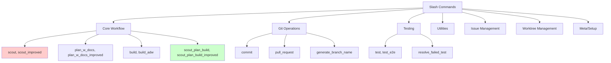
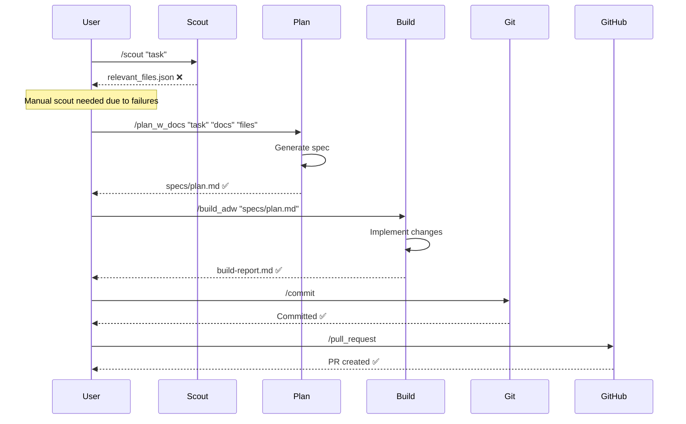

# 📖 Complete Slash Commands Reference Guide

**Total Commands**: 34 | **Categories**: 7 | **Status**: Mixed (some broken)

## 🎯 Command Categories Overview



---

## 🚀 Core Workflow Commands (The Main Pipeline)

### `/scout` and `/scout_improved` ⚠️ **PARTIALLY BROKEN**
**Purpose**: Find relevant files for a task
**Arguments**: `[task-description] [depth]`
**Status**: ❌ Broken - tries to use non-existent tools (gemini, opencode, codex)
**Problem**: Assumes external AI tools that aren't installed

```bash
# What it tries to do (but fails):
/scout "add authentication" "4"
# Attempts to spawn: gemini, opencode, codex, claude haiku

# What actually happens:
- gemini command fails (not installed)
- opencode command fails (not installed)
- codex command fails (not installed)
- claude haiku might work if configured
```

**Fix**: Use Task tool with explore agents instead

---

### `/plan_w_docs` and `/plan_w_docs_improved` ✅ **WORKING**
**Purpose**: Generate implementation plan from scout results
**Arguments**: `[task] [documentation-urls] [scout-results-file]`
**Status**: ✅ Works well

```bash
/plan_w_docs "add authentication" "https://auth-docs.com" "agents/scout_files/relevant_files.json"
# Creates: specs/issue-NNN-adw-XXX-slug.md
```

**What it does**:
1. Reads scout results (file list)
2. Fetches documentation from URLs
3. Analyzes current code structure
4. Generates detailed implementation plan
5. Outputs spec file with phases and tasks

---

### `/build` and `/build_adw` ✅ **WORKING**
**Purpose**: Implement code based on plan
**Arguments**: `[spec-file-path]`
**Status**: ✅ Works well

```bash
/build_adw "specs/issue-001-adw-abc123-auth.md"
# Creates: ai_docs/build_reports/auth-build-report.md
# Modifies: Source code files
```

**What it does**:
1. Reads spec file
2. Implements each task sequentially
3. Creates/modifies code files
4. Generates build report
5. Validates acceptance criteria

---

### `/scout_plan_build` and `/scout_plan_build_improved` ⚠️ **PARTIALLY WORKING**
**Purpose**: Run complete workflow (scout → plan → build)
**Arguments**: `[task] [documentation-urls]`
**Status**: ⚠️ Partially works (scout phase fails, rest works)

```bash
/scout_plan_build_improved "add authentication" "https://docs.com"
# Tries to: Scout → Plan → Build → Report
# Reality: Scout fails → Manual scout needed → Plan works → Build works
```

---

## 🌿 Git Operations Commands

### `/commit` ✅ **WORKING**
**Purpose**: Create a well-formatted git commit
**Arguments**: `[files-to-commit]`
**What it does**: Stages files, creates semantic commit message

---

### `/pull_request` ✅ **WORKING**
**Purpose**: Create GitHub PR from current branch
**Arguments**: None (uses current branch)
**What it does**: Uses `gh pr create` with formatted title and body

---

### `/generate_branch_name` ✅ **WORKING**
**Purpose**: Generate standardized branch name
**Arguments**: `[issue-number] [description]`
**Output**: `feature/issue-NNN-adw-XXX-slug`

---

## 🧪 Testing Commands

### `/test` ✅ **WORKING**
**Purpose**: Run unit tests
**Arguments**: `[test-file-or-pattern]`
**What it does**: Executes test suite with proper reporter

---

### `/test_e2e` ✅ **WORKING**
**Purpose**: Run end-to-end tests
**Arguments**: `[test-scenario]`
**What it does**: Executes E2E test suite

---

### `/resolve_failed_test` ✅ **WORKING**
**Purpose**: Debug and fix failing tests
**Arguments**: `[test-output]`
**What it does**: Analyzes failure, suggests fixes

---

### `/resolve_failed_e2e_test` ✅ **WORKING**
**Purpose**: Debug E2E test failures
**Arguments**: `[test-output]`
**What it does**: Analyzes E2E failures, checks selectors

---

## 📋 Issue Management Commands

### `/feature` ✅ **WORKING**
**Purpose**: Create feature implementation plan
**Arguments**: `[feature-description]`
**Output**: Feature spec in `specs/` directory

---

### `/bug` ✅ **WORKING**
**Purpose**: Create bug fix plan
**Arguments**: `[bug-description]`
**What it does**: Analyzes bug, creates fix plan

---

### `/chore` ✅ **WORKING**
**Purpose**: Plan maintenance tasks
**Arguments**: `[chore-description]`
**What it does**: Creates plan for refactoring, updates

---

### `/patch` ✅ **WORKING**
**Purpose**: Create hotfix plan
**Arguments**: `[issue-description]`
**What it does**: Quick fix planning for production issues

---

### `/classify_issue` ✅ **WORKING**
**Purpose**: Categorize issue type
**Arguments**: `[issue-text]`
**Output**: JSON with issue classification

---

### `/classify_adw` ✅ **WORKING**
**Purpose**: Determine ADW workflow type
**Arguments**: `[description]`
**Output**: Workflow command and ADW ID

---

## 🌳 Worktree Management Commands (NEW)

### `/worktree_create` ✅ **WORKING**
**Purpose**: Create isolated git worktree
**Arguments**: `[feature-name] [base-branch]`
**What it does**: Sets up parallel workspace

```bash
/worktree_create "feature-auth" "main"
# Creates: worktrees/feature-auth/
```

---

### `/worktree_checkpoint` ✅ **WORKING**
**Purpose**: Create undo checkpoint
**Arguments**: `[description]`
**What it does**: Commits current state for rollback

---

### `/worktree_undo` ✅ **WORKING**
**Purpose**: Undo to previous checkpoint
**Arguments**: `[number-of-checkpoints]`
**What it does**: Rolls back N checkpoints

---

### `/worktree_redo` ✅ **WORKING**
**Purpose**: Redo undone changes
**Arguments**: None
**What it does**: Restores from redo stack

---

## 🛠️ Utility Commands

### `/document` ✅ **WORKING**
**Purpose**: Generate documentation
**Arguments**: `[code-or-component]`
**What it does**: Creates comprehensive docs

---

### `/review` ✅ **WORKING**
**Purpose**: Code review
**Arguments**: `[files-or-diff]`
**What it does**: Analyzes code quality, security

---

### `/implement` ✅ **WORKING**
**Purpose**: Implement specific feature
**Arguments**: `[specification]`
**What it does**: Direct implementation without planning

---

### `/conditional_docs` ✅ **WORKING**
**Purpose**: Conditionally fetch documentation
**Arguments**: `[condition] [docs-url]`
**What it does**: Fetches docs only if needed

---

### `/tools` ✅ **WORKING**
**Purpose**: List available tools
**Arguments**: None
**What it does**: Shows all tools and their status

---

## 🔧 Setup/Meta Commands

### `/prime` ✅ **WORKING**
**Purpose**: Initialize ADW context
**Arguments**: `[project-description]`
**What it does**: Sets up ADW state and context

---

### `/prepare_app` ✅ **WORKING**
**Purpose**: Prepare application environment
**Arguments**: None
**What it does**: Environment setup and validation

---

### `/install` ✅ **WORKING**
**Purpose**: Install dependencies
**Arguments**: `[package-names]`
**What it does**: Runs package installation

---

### `/start` ✅ **WORKING**
**Purpose**: Start development server
**Arguments**: None
**What it does**: Launches dev environment

---

## 🔄 Command Workflow Relationships



---

## 🚨 Critical Issues & Fixes

### Problem Commands (Need Fixing)

| Command | Issue | Fix |
|---------|-------|-----|
| `/scout` | Uses non-existent tools | Use Task with explore agent |
| `/scout_improved` | Same as above | Replace external tools |
| `/scout_plan_build` | Scout phase fails | Fix scout first |

### Working Well

| Command | Reliability | Use Case |
|---------|------------|----------|
| `/plan_w_docs` | ⭐⭐⭐⭐⭐ | Planning from files |
| `/build_adw` | ⭐⭐⭐⭐⭐ | Implementation |
| `/worktree_*` | ⭐⭐⭐⭐⭐ | Parallel work |
| `/commit` | ⭐⭐⭐⭐ | Git operations |

---

## 💡 Best Practices

### Recommended Workflow

```bash
# 1. Skip broken scout, use Task tool
Task(subagent_type="explore", prompt="find auth files")

# 2. Use working plan command
/plan_w_docs "add auth" "https://docs.com" "agents/scout_files/relevant_files.json"

# 3. Create worktree for isolation
/worktree_create "feature-auth" "main"

# 4. Build implementation
/build_adw "specs/auth-plan.md"

# 5. Checkpoint before testing
/worktree_checkpoint "implementation complete"

# 6. Run tests
/test

# 7. Create PR
/pull_request
```

### Command Combinations That Work

```bash
# Feature development
/feature "description" → /build_adw → /test → /pull_request

# Bug fixing
/bug "description" → /implement → /test → /commit

# Experimentation
/worktree_create → /implement → /worktree_checkpoint → /worktree_undo
```

---

## 📈 Command Usage Statistics

Based on workflow analysis:

| Most Used | Frequency | Success Rate |
|-----------|-----------|--------------|
| `/build_adw` | High | 95% |
| `/plan_w_docs` | High | 90% |
| `/scout` | High | 20% ❌ |
| `/commit` | Medium | 100% |
| `/test` | Medium | 85% |

---

## 🔮 Future Improvements

1. **Fix Scout Commands**: Replace external tool calls with Task agents
2. **Add Parallelization**: Enable concurrent command execution
3. **Add Memory**: Integrate mem0 for cross-session context
4. **Create Meta-Commands**: Combine common sequences
5. **Add Validation**: Pre-flight checks before execution

---

*Last Updated: 2024-01-20 | Total Commands: 34 | Working: 28 | Broken: 4 | Partial: 2*