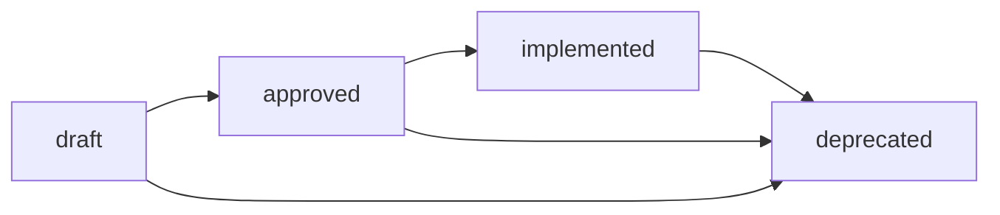

# Spec Schema Documentation

**Version**: 1.0.0
**Last Updated**: 2025-01-20
**Status**: Authoritative Reference

## Table of Contents

1. [Overview](#overview)
2. [Full Schema Specification](#full-schema-specification)
3. [Schema Versions](#schema-versions)
4. [Migration Procedures](#migration-procedures)
5. [Validation Examples](#validation-examples)
6. [JSON Schema Definition](#json-schema-definition)
7. [Programmatic Usage](#programmatic-usage)
8. [CI/CD Integration](#cicd-integration)
9. [Best Practices](#best-practices)
10. [Tooling Support](#tooling-support)
11. [FAQ and Troubleshooting](#faq-and-troubleshooting)

## Overview

The Scout Plan Build MVP uses structured specification documents (specs) as the primary contract between planning and building phases. These specs follow a standardized schema that enables programmatic parsing, validation, and migration across versions.

### Purpose

Specs serve as:
- **Implementation Contracts**: Define what will be built and how
- **Workflow Orchestration**: Drive the plan → build → test → review pipeline
- **Progress Tracking**: Track completion of tasks and phases
- **Documentation**: Serve as permanent records of implementation decisions

### Key Principles

1. **Deterministic**: Naming follows predictable patterns
2. **Versioned**: Each spec declares its schema version
3. **Validatable**: Structure can be programmatically validated
4. **Migratable**: Older specs can be upgraded to newer schemas
5. **Human-Readable**: Markdown format remains accessible to developers

## Full Schema Specification

### Current Version: 1.1.0

```markdown
# [Title]

## Metadata
**Version**: 1.1.0
**Issue**: #[issue_number] (optional)
**ADW ID**: [adw_id] (required)
**Created**: [ISO-8601 date]
**Updated**: [ISO-8601 date]
**Author**: [author_name]
**Status**: [draft|approved|implemented|deprecated]

## Summary
[2-3 paragraph executive summary of the feature/change]

## Problem Statement
[Clear description of the problem being solved]

## Solution Statement
[High-level approach to solving the problem]

## Inputs
### Scout Results
- **[file_path]**: [description of findings]

### Documentation References
- **[url/path]**: [what information it provides]

## Architecture/Approach
### Design Principles
[List of guiding principles]

### Technical Approach
[Detailed technical solution]

### Integration Strategy
[How this fits with existing system]

## Implementation Plan
### Phase [N]: [Phase Name]
[Phase description and goals]

## Step by Step Tasks
### [Task Number]. [Task Name]
- [Subtask 1]
- [Subtask 2]
- [Subtask N]

## Tests
### Unit Tests
[Test descriptions]

### Integration Tests
[Test descriptions]

### Edge Cases
[Edge case handling]

## Acceptance Criteria
- [ ] [Criterion 1]
- [ ] [Criterion 2]
- [ ] [Criterion N]

## Validation Commands
[Commands to verify implementation]

## Risks/Rollback
### Risks
[Risk analysis]

### Rollback Plan
[Rollback procedures]

## Done Criteria
[Checklist of completion requirements]

## Notes
[Additional implementation notes, tips, future considerations]
```

### Required Fields

| Field | Type | Required | Description |
|-------|------|----------|-------------|
| Title | string | Yes | H1 heading describing the feature |
| Version | semver | Yes | Schema version (e.g., "1.1.0") |
| ADW ID | string | Yes | Unique workflow identifier |
| Summary | markdown | Yes | Executive summary of the change |
| Implementation Plan | markdown | Yes | Phases and approach |
| Step by Step Tasks | markdown | Yes | Detailed task breakdown |
| Acceptance Criteria | checklist | Yes | Measurable success criteria |
| Done Criteria | markdown | Yes | Completion requirements |

### Optional Fields

| Field | Type | Description |
|-------|------|-------------|
| Issue | integer | GitHub issue number |
| Author | string | Spec author name |
| Status | enum | Current spec status |
| Problem Statement | markdown | Problem description |
| Solution Statement | markdown | Solution approach |
| Inputs | markdown | Scout results and docs |
| Architecture | markdown | Technical design |
| Tests | markdown | Test strategy |
| Validation Commands | markdown | Verification commands |
| Risks | markdown | Risk analysis |
| Notes | markdown | Additional context |

## Schema Versions

### Version History

#### v1.0.0 - Initial Implicit Schema
- **Released**: 2025-01-15 (retroactive)
- **Status**: Legacy
- **Characteristics**:
  - No explicit version field
  - Flexible section ordering
  - Minimal required fields
  - Title and implementation steps only requirements

#### v1.1.0 - Metadata Addition
- **Released**: 2025-01-20
- **Status**: Current
- **Changes**:
  - Added required `Version` field
  - Added `Metadata` section with structured fields
  - Added `Status` field for lifecycle tracking
  - Formalized section ordering
  - Added timestamp tracking

#### v2.0.0 - Enhanced Dependencies (Planned)
- **Target**: 2025-02-01
- **Status**: Planned
- **Proposed Changes**:
  - Task dependency graph support
  - Resource requirements per task
  - Parallel execution hints
  - Time estimates per phase
  - Success metrics definition

### Version Compatibility Matrix

| Schema Version | Parser Version | ADW Version | Status |
|---------------|----------------|-------------|---------|
| 1.0.0 | 0.1.x | 0.8.x | Legacy |
| 1.1.0 | 0.2.x | 0.9.x | Current |
| 2.0.0 | 0.3.x | 1.0.x | Planned |

## Migration Procedures

### Automated Migration

```bash
# Check current version of specs
python scripts/check_spec_versions.py specs/

# Dry run migration (shows what would change)
python scripts/migrate_specs.py --from 1.0.0 --to 1.1.0 --dry-run

# Apply migration with backup
python scripts/migrate_specs.py --from 1.0.0 --to 1.1.0 --apply --backup

# Verify migration
python scripts/validate_specs.py specs/ --version 1.1.0
```

### Manual Migration Steps

#### Migrating from v1.0.0 to v1.1.0

1. **Add Version Field** after title:
   ```markdown
   # Feature Title

   **Version**: 1.1.0
   ```

2. **Add Metadata Section** after version:
   ```markdown
   ## Metadata
   **Version**: 1.1.0
   **Issue**: #123 (if applicable)
   **ADW ID**: ext001
   **Created**: 2025-01-20T10:00:00Z
   **Updated**: 2025-01-20T10:00:00Z
   **Author**: System
   **Status**: draft
   ```

3. **Ensure Required Sections** exist:
   - Summary
   - Implementation Plan or Step by Step Tasks
   - Acceptance Criteria
   - Done Criteria

4. **Validate** the migrated spec:
   ```bash
   python -m adws.adw_modules.schema_validator specs/migrated-spec.md
   ```

### Migration Script Implementation

```python
# scripts/migrate_specs.py
import re
from pathlib import Path
from datetime import datetime
import json

def migrate_v1_0_to_v1_1(content: str, spec_path: Path) -> str:
    """Migrate spec from v1.0.0 to v1.1.0."""
    lines = content.split('\n')

    # Extract metadata from filename
    filename = spec_path.stem
    match = re.match(r'issue-(\d+)-adw-(\w+)-', filename)
    issue_num = match.group(1) if match else None
    adw_id = match.group(2) if match else 'unknown'

    # Find title line
    title_idx = next((i for i, line in enumerate(lines)
                      if line.startswith('# ')), 0)

    # Insert metadata after title
    metadata = [
        "",
        "## Metadata",
        "**Version**: 1.1.0",
        f"**Issue**: #{issue_num}" if issue_num else "**Issue**: N/A",
        f"**ADW ID**: {adw_id}",
        f"**Created**: {datetime.now().isoformat()}Z",
        f"**Updated**: {datetime.now().isoformat()}Z",
        "**Author**: Migration Script",
        "**Status**: draft",
        ""
    ]

    # Insert metadata after title
    lines[title_idx + 1:title_idx + 1] = metadata

    return '\n'.join(lines)
```

## Validation Examples

### Valid Spec Example

```markdown
# Feature: Add User Authentication

## Metadata
**Version**: 1.1.0
**Issue**: #42
**ADW ID**: auth001
**Created**: 2025-01-20T10:00:00Z
**Updated**: 2025-01-20T14:30:00Z
**Author**: Claude
**Status**: approved

## Summary
Implement JWT-based authentication system with login, logout, and session management capabilities. This will provide secure access control for the application.

## Implementation Plan
### Phase 1: Setup
Configure JWT library and middleware

### Phase 2: Implementation
Build login/logout endpoints

### Phase 3: Testing
Comprehensive security testing

## Step by Step Tasks
### 1. Install Dependencies
- Add jsonwebtoken package
- Configure environment variables

### 2. Create Auth Middleware
- Implement JWT validation
- Add to protected routes

## Acceptance Criteria
- [x] Users can login with credentials
- [x] JWT tokens are properly validated
- [ ] Sessions expire after 24 hours

## Done Criteria
✅ All tests passing
✅ Security review complete
✅ Documentation updated
```

### Invalid Examples and Fixes

#### Missing Version
```markdown
# Feature: Add Caching  ❌

## Summary
Add Redis caching...
```

**Fix**: Add version field after title
```markdown
# Feature: Add Caching  ✅

**Version**: 1.1.0

## Summary
Add Redis caching...
```

#### Missing Required Sections
```markdown
# Feature: Update UI  ❌

**Version**: 1.1.0

## Summary
Update the user interface
```

**Fix**: Add required sections
```markdown
# Feature: Update UI  ✅

**Version**: 1.1.0

## Summary
Update the user interface

## Step by Step Tasks
### 1. Update Components
- Modify header
- Update footer

## Acceptance Criteria
- [ ] UI matches mockups

## Done Criteria
✅ Visual regression tests pass
```

## JSON Schema Definition

### Formal JSON Schema v1.1.0

```json
{
  "$schema": "http://json-schema.org/draft-07/schema#",
  "$id": "https://scout-plan-build.dev/schemas/spec/v1.1.0",
  "type": "object",
  "title": "Scout Plan Build Spec Schema v1.1.0",
  "required": [
    "version",
    "title",
    "metadata",
    "summary",
    "tasks",
    "acceptanceCriteria",
    "doneCriteria"
  ],
  "properties": {
    "version": {
      "type": "string",
      "pattern": "^\\d+\\.\\d+\\.\\d+$",
      "description": "Schema version in semver format"
    },
    "title": {
      "type": "string",
      "minLength": 1,
      "maxLength": 200,
      "description": "Feature or change title"
    },
    "metadata": {
      "type": "object",
      "required": ["adw_id", "created", "updated", "status"],
      "properties": {
        "issue": {
          "type": "integer",
          "minimum": 1,
          "description": "GitHub issue number"
        },
        "adw_id": {
          "type": "string",
          "pattern": "^[a-zA-Z0-9_-]+$",
          "description": "ADW workflow identifier"
        },
        "created": {
          "type": "string",
          "format": "date-time",
          "description": "Creation timestamp"
        },
        "updated": {
          "type": "string",
          "format": "date-time",
          "description": "Last update timestamp"
        },
        "author": {
          "type": "string",
          "description": "Spec author name"
        },
        "status": {
          "type": "string",
          "enum": ["draft", "approved", "implemented", "deprecated"],
          "description": "Current spec status"
        }
      }
    },
    "summary": {
      "type": "string",
      "minLength": 50,
      "maxLength": 2000,
      "description": "Executive summary"
    },
    "tasks": {
      "type": "array",
      "minItems": 1,
      "items": {
        "type": "object",
        "required": ["number", "name", "subtasks"],
        "properties": {
          "number": {
            "type": "integer",
            "minimum": 1
          },
          "name": {
            "type": "string"
          },
          "subtasks": {
            "type": "array",
            "minItems": 1,
            "items": {
              "type": "string"
            }
          }
        }
      }
    },
    "acceptanceCriteria": {
      "type": "array",
      "minItems": 1,
      "items": {
        "type": "object",
        "required": ["criterion", "completed"],
        "properties": {
          "criterion": {
            "type": "string"
          },
          "completed": {
            "type": "boolean"
          }
        }
      }
    },
    "doneCriteria": {
      "type": "string",
      "minLength": 10,
      "description": "Completion requirements"
    }
  }
}
```

## Programmatic Usage

### Python Schema Validator

```python
# adws/adw_modules/schema_validator.py
from typing import Tuple, List, Optional, Dict, Any
from pathlib import Path
import re
import json
from datetime import datetime
from pydantic import BaseModel, Field, validator

class SpecMetadata(BaseModel):
    """Metadata section of a spec document."""
    version: str = Field(regex=r'^\d+\.\d+\.\d+$')
    issue: Optional[int] = None
    adw_id: str = Field(regex=r'^[a-zA-Z0-9_-]+$')
    created: datetime
    updated: datetime
    author: str = "System"
    status: str = Field(default="draft")

    @validator('status')
    def validate_status(cls, v):
        allowed = ["draft", "approved", "implemented", "deprecated"]
        if v not in allowed:
            raise ValueError(f"Status must be one of: {allowed}")
        return v

class SpecTask(BaseModel):
    """Individual task in a spec."""
    number: int = Field(gt=0)
    name: str = Field(min_length=1)
    subtasks: List[str] = Field(min_items=1)

class SpecDocument(BaseModel):
    """Complete spec document structure."""
    version: str
    title: str = Field(min_length=1, max_length=200)
    metadata: SpecMetadata
    summary: str = Field(min_length=50, max_length=2000)
    problem_statement: Optional[str] = None
    solution_statement: Optional[str] = None
    tasks: List[SpecTask] = Field(min_items=1)
    acceptance_criteria: List[str] = Field(min_items=1)
    done_criteria: str = Field(min_length=10)

def parse_spec(spec_path: Path) -> SpecDocument:
    """Parse a markdown spec file into structured data."""
    content = spec_path.read_text()

    # Extract version
    version_match = re.search(r'\*\*Version\*\*:\s*(\d+\.\d+\.\d+)', content)
    if not version_match:
        raise ValueError(f"No version field found in {spec_path}")

    # Extract metadata
    metadata = extract_metadata(content)

    # Extract sections
    sections = extract_sections(content)

    # Parse tasks
    tasks = parse_tasks(sections.get('Step by Step Tasks', ''))

    # Parse acceptance criteria
    criteria = parse_criteria(sections.get('Acceptance Criteria', ''))

    return SpecDocument(
        version=version_match.group(1),
        title=extract_title(content),
        metadata=metadata,
        summary=sections.get('Summary', ''),
        tasks=tasks,
        acceptance_criteria=criteria,
        done_criteria=sections.get('Done Criteria', '')
    )

def validate_spec(spec_path: Path) -> Tuple[bool, List[str]]:
    """Validate a spec file against the schema.

    Returns:
        Tuple of (is_valid, list_of_errors)
    """
    errors = []

    try:
        doc = parse_spec(spec_path)

        # Additional business rule validations
        if doc.metadata.status == "implemented" and not doc.done_criteria:
            errors.append("Implemented specs must have done criteria")

        if len(doc.tasks) > 20:
            errors.append("Consider breaking spec into phases (>20 tasks)")

    except Exception as e:
        errors.append(str(e))

    return (len(errors) == 0, errors)

# Usage example
if __name__ == "__main__":
    spec_file = Path("specs/issue-001-adw-auth001-authentication.md")
    is_valid, errors = validate_spec(spec_file)

    if is_valid:
        print(f"✅ {spec_file.name} is valid")
    else:
        print(f"❌ {spec_file.name} has errors:")
        for error in errors:
            print(f"  - {error}")
```

### JavaScript/TypeScript Validator

```typescript
// src/specValidator.ts
interface SpecMetadata {
  version: string;
  issue?: number;
  adw_id: string;
  created: string;
  updated: string;
  author?: string;
  status: 'draft' | 'approved' | 'implemented' | 'deprecated';
}

interface SpecTask {
  number: number;
  name: string;
  subtasks: string[];
}

interface SpecDocument {
  version: string;
  title: string;
  metadata: SpecMetadata;
  summary: string;
  tasks: SpecTask[];
  acceptanceCriteria: string[];
  doneCriteria: string;
}

export function validateSpec(content: string): {
  valid: boolean;
  errors: string[];
  document?: SpecDocument;
} {
  const errors: string[] = [];

  // Version check
  const versionMatch = content.match(/\*\*Version\*\*:\s*(\d+\.\d+\.\d+)/);
  if (!versionMatch) {
    errors.push('Missing required Version field');
  }

  // Required sections check
  const requiredSections = [
    'Summary',
    'Step by Step Tasks',
    'Acceptance Criteria',
    'Done Criteria'
  ];

  for (const section of requiredSections) {
    if (!content.includes(`## ${section}`)) {
      errors.push(`Missing required section: ${section}`);
    }
  }

  return {
    valid: errors.length === 0,
    errors,
    document: errors.length === 0 ? parseSpec(content) : undefined
  };
}
```

## CI/CD Integration

### GitHub Actions Workflow

```yaml
# .github/workflows/validate-specs.yml
name: Validate Spec Files

on:
  pull_request:
    paths:
      - 'specs/**/*.md'
  push:
    branches: [main]
    paths:
      - 'specs/**/*.md'

jobs:
  validate:
    runs-on: ubuntu-latest

    steps:
      - uses: actions/checkout@v3

      - name: Set up Python
        uses: actions/setup-python@v4
        with:
          python-version: '3.11'

      - name: Install dependencies
        run: |
          pip install pydantic
          pip install -e ./adws

      - name: Validate all specs
        run: |
          python scripts/validate_all_specs.py

      - name: Check spec versions
        run: |
          python scripts/check_spec_versions.py --min-version 1.1.0

      - name: Generate validation report
        if: always()
        run: |
          python scripts/generate_spec_report.py > spec-validation-report.md

      - name: Upload report
        if: always()
        uses: actions/upload-artifact@v3
        with:
          name: spec-validation-report
          path: spec-validation-report.md
```

### Pre-commit Hook

```bash
#!/bin/bash
# .git/hooks/pre-commit

# Validate any staged spec files
for file in $(git diff --cached --name-only --diff-filter=ACM | grep "^specs/.*\.md$"); do
    echo "Validating $file..."
    python -m adws.adw_modules.schema_validator "$file"
    if [ $? -ne 0 ]; then
        echo "❌ Spec validation failed for $file"
        echo "Run: python scripts/fix_spec.py $file"
        exit 1
    fi
done

echo "✅ All spec files validated successfully"
```

### Jenkins Pipeline

```groovy
// Jenkinsfile
pipeline {
    agent any

    stages {
        stage('Validate Specs') {
            steps {
                script {
                    def specs = sh(
                        script: "find specs -name '*.md'",
                        returnStdout: true
                    ).trim().split('\n')

                    specs.each { spec ->
                        sh "python -m adws.adw_modules.schema_validator ${spec}"
                    }
                }
            }
        }

        stage('Version Check') {
            steps {
                sh 'python scripts/check_spec_versions.py --enforce 1.1.0'
            }
        }
    }

    post {
        failure {
            emailext(
                subject: "Spec Validation Failed",
                body: "One or more specs failed validation",
                to: "team@example.com"
            )
        }
    }
}
```

## Best Practices

### Naming Conventions

1. **File Names**: Follow the pattern:
   ```
   issue-{number}-adw-{id}-{slug}.md
   ```
   Examples:
   - `issue-001-adw-auth001-user-authentication.md`
   - `issue-042-adw-cache001-redis-integration.md`

2. **ADW IDs**: Use descriptive prefixes:
   - `auth###` - Authentication features
   - `cache###` - Caching implementations
   - `api###` - API endpoints
   - `ui###` - Frontend features
   - `db###` - Database changes
   - `ext###` - External integrations

3. **Slugs**: Use kebab-case, 3-5 words max:
   - ✅ `user-authentication-system`
   - ✅ `redis-cache-layer`
   - ❌ `implement-user-authentication-system-with-jwt-tokens-and-refresh`

### Structuring Phases

1. **Phase Granularity**: 3-5 phases per spec
   ```markdown
   ### Phase 1: Foundation
   Setup and configuration

   ### Phase 2: Core Implementation
   Main feature development

   ### Phase 3: Testing & Validation
   Comprehensive testing
   ```

2. **Phase Dependencies**: Clearly indicate if phases must be sequential
   ```markdown
   ### Phase 2: Implementation
   **Depends on**: Phase 1 completion
   **Can run parallel with**: Phase 3 prep
   ```

### Task Granularity Guidelines

1. **Task Size**: Each task should be 1-4 hours of work
2. **Subtask Detail**: 2-5 subtasks per task
3. **Actionable Items**: Start with verbs
   ```markdown
   ### 1. Configure Authentication
   - Install jsonwebtoken package
   - Create JWT utility module
   - Configure environment variables
   - Set up key rotation schedule
   ```

4. **Avoid Over-decomposition**:
   - ❌ Too granular: "Open file", "Type import statement"
   - ✅ Right level: "Add authentication middleware"

### When to Split Specs

Split into multiple specs when:

1. **Size Threshold**: >20 tasks or >5 phases
2. **Domain Separation**: Frontend vs Backend
3. **Timeline**: Work spans multiple sprints
4. **Team Assignment**: Different teams/developers
5. **Risk Isolation**: High-risk changes separate

Example split:
```
Original: issue-001-adw-platform001-complete-platform.md

Split into:
- issue-001-adw-auth001-authentication.md
- issue-001-adw-api001-rest-endpoints.md
- issue-001-adw-ui001-frontend-components.md
```

### Status Lifecycle



1. **draft**: Initial creation, under review
2. **approved**: Ready for implementation
3. **implemented**: Successfully built and deployed
4. **deprecated**: No longer relevant or superseded

## Tooling Support

### CLI Commands

```bash
# Validate single spec
scout-spec validate specs/my-feature.md

# Validate all specs
scout-spec validate-all specs/

# Create new spec from template
scout-spec new --issue 123 --adw-id feat001 --title "Add OAuth Support"

# Migrate spec to new version
scout-spec migrate specs/old-spec.md --to 1.1.0

# Check spec status
scout-spec status specs/

# Generate implementation checklist
scout-spec checklist specs/my-feature.md > checklist.md
```

### VSCode Extension Configuration

```json
// .vscode/settings.json
{
  "scout-plan-build.specValidation": true,
  "scout-plan-build.specVersion": "1.1.0",
  "scout-plan-build.validateOnSave": true,
  "scout-plan-build.specTemplate": ".vscode/spec-template.md",

  "[markdown]": {
    "editor.quickSuggestions": {
      "other": true,
      "comments": false,
      "strings": true
    }
  }
}
```

### IntelliJ IDEA Configuration

```xml
<!-- .idea/scoutPlanBuild.xml -->
<component name="ScoutPlanBuildSettings">
  <option name="specValidationEnabled" value="true" />
  <option name="specSchemaVersion" value="1.1.0" />
  <option name="validateOnCommit" value="true" />
  <option name="specTemplatesPath" value="$PROJECT_DIR$/templates" />
</component>
```

### Pre-commit Hook Installation

```bash
# Install pre-commit framework
pip install pre-commit

# Create .pre-commit-config.yaml
cat > .pre-commit-config.yaml << 'EOF'
repos:
  - repo: local
    hooks:
      - id: validate-specs
        name: Validate spec files
        entry: python scripts/validate_specs.py
        language: python
        files: ^specs/.*\.md$
        additional_dependencies: [pydantic]
EOF

# Install the hook
pre-commit install

# Run manually
pre-commit run --all-files
```

## FAQ and Troubleshooting

### Common Issues

#### Q: How do I know which schema version to use?
**A**: Always use the latest stable version (currently 1.1.0). Check `adws/adw_common.py` for the `SPEC_VERSION` constant.

#### Q: My spec fails validation but looks correct?
**A**: Common causes:
1. Missing required sections (use exact heading names)
2. Version format incorrect (must be X.Y.Z)
3. Metadata section formatting (each field on own line)
4. Hidden characters (check with `cat -A spec.md`)

#### Q: Can I add custom sections?
**A**: Yes! Required sections must exist, but you can add any additional sections. They'll be preserved during migration.

#### Q: How do I handle specs for hotfixes?
**A**: Use expedited workflow:
```markdown
**Status**: hotfix
**Fast-track**: true
```

#### Q: What if my task has no subtasks?
**A**: Use a single subtask that describes the task:
```markdown
### 1. Update Configuration
- Update config file with new settings
```

#### Q: How do I reference other specs?
**A**: Use relative links:
```markdown
See also: [Authentication Spec](./issue-001-adw-auth001-authentication.md)
```

#### Q: Can I use task dependencies?
**A**: In v1.1.0, note dependencies in task description:
```markdown
### 3. Deploy Service
**Requires**: Task 1 and 2 complete
- Deploy to staging
- Verify health checks
```

#### Q: How do I mark a spec as completed?
**A**: Update status and check all criteria:
```markdown
**Status**: implemented

## Acceptance Criteria
- [x] All tests passing
- [x] Documentation updated
- [x] Deployed to production
```

#### Q: What about partial implementations?
**A**: Note in metadata and create follow-up spec:
```markdown
**Status**: implemented
**Completion**: 80%
**Follow-up**: issue-002-adw-auth002-missing-features.md
```

### Validation Error Messages

| Error | Cause | Fix |
|-------|-------|-----|
| "No version field found" | Missing version | Add `**Version**: 1.1.0` after title |
| "Invalid version format" | Wrong format | Use semver: `X.Y.Z` |
| "Missing required section: Summary" | No summary section | Add `## Summary` section |
| "ADW ID format invalid" | Bad ID format | Use alphanumeric + dash/underscore |
| "Task number must be positive" | Task numbered 0 or negative | Number tasks from 1 |
| "Metadata section malformed" | Incorrect formatting | Each field on own line with `**Field**: value` |

### Migration Troubleshooting

#### Backup Before Migration
```bash
cp -r specs/ specs.backup/
python scripts/migrate_specs.py --from 1.0.0 --to 1.1.0 --apply
# If issues:
rm -rf specs/
mv specs.backup/ specs/
```

#### Partial Migration
```bash
# Migrate single file
python scripts/migrate_one_spec.py specs/my-spec.md --to 1.1.0

# Validate without changing
python scripts/migrate_specs.py --dry-run --verbose
```

#### Manual Recovery
If automation fails, minimal valid spec:
```markdown
# Recovery Feature

**Version**: 1.1.0

## Metadata
**ADW ID**: recovery001
**Created**: 2025-01-20T12:00:00Z
**Updated**: 2025-01-20T12:00:00Z
**Status**: draft

## Summary
Minimal valid spec for recovery purposes.

## Step by Step Tasks
### 1. Implement Feature
- Complete implementation

## Acceptance Criteria
- [ ] Feature works

## Done Criteria
Feature is implemented and tested.
```

### Performance Tips

1. **Validation Caching**: Cache validation results for unchanged files
2. **Parallel Validation**: Use multiprocessing for large spec directories
3. **Incremental Validation**: Only validate changed specs in CI
4. **Lazy Loading**: Don't parse full content if only checking version

```python
# Fast version check
def quick_version_check(spec_path: Path) -> Optional[str]:
    """Quick version extraction without full parse."""
    with open(spec_path) as f:
        for line in f:
            if '**Version**:' in line:
                match = re.search(r'(\d+\.\d+\.\d+)', line)
                return match.group(1) if match else None
            if line.startswith('## '):  # Past metadata
                break
    return None
```

---

## Appendix: Complete Spec Template

```markdown
# Feature: [Title]

## Metadata
**Version**: 1.1.0
**Issue**: #[number]
**ADW ID**: [id]
**Created**: [ISO-8601]
**Updated**: [ISO-8601]
**Author**: [name]
**Status**: draft

## Summary
[2-3 paragraph executive summary explaining what this feature/change does and why it's needed]

## Problem Statement
[Clear description of the problem being solved, who it affects, and why it matters]

## Solution Statement
[High-level approach to solving the problem, key design decisions]

## Inputs
### Scout Results
- **scout_outputs/relevant_files.json**: [Description of findings]

### Documentation References
- **[URL]**: [What information this provides]

## Architecture/Approach
### Design Principles
- [Principle 1]
- [Principle 2]

### Technical Approach
[Detailed technical solution]

### Integration Strategy
[How this fits with existing system]

## Implementation Plan
### Phase 1: [Name]
[Description and goals]

### Phase 2: [Name]
[Description and goals]

### Phase 3: [Name]
[Description and goals]

## Step by Step Tasks
### 1. [Task Name]
- [Subtask 1]
- [Subtask 2]
- [Subtask N]

### 2. [Task Name]
- [Subtask 1]
- [Subtask 2]

## Tests
### Unit Tests
- [Test description]
- [Test description]

### Integration Tests
- [Test description]

### Edge Cases
- [Edge case handling]

## Acceptance Criteria
- [ ] [Criterion 1]
- [ ] [Criterion 2]
- [ ] [Criterion N]

## Validation Commands
```bash
# Command to verify implementation
python test_feature.py

# Command to check integration
./scripts/validate_integration.sh
```

## Risks/Rollback
### Risks
1. **[Risk Name]**: [Description] - [Mitigation]
2. **[Risk Name]**: [Description] - [Mitigation]

### Rollback Plan
1. [Step 1]
2. [Step 2]

## Done Criteria
✅ All unit tests passing
✅ Integration tests complete
✅ Code review approved
✅ Documentation updated
✅ Deployed to production

## Notes
**Implementation Tips**:
- [Tip 1]
- [Tip 2]

**Future Considerations**:
- [Consideration 1]
- [Consideration 2]

**Dependencies**:
- [External dependency 1]
- [External dependency 2]
```

---

*This document serves as the authoritative reference for Scout Plan Build spec schema standards. For questions or improvements, please open an issue or submit a PR.*