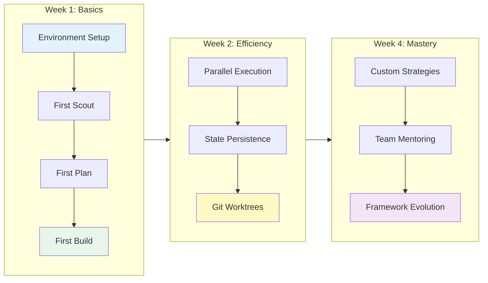

# Scout Plan Build MVP - Team Onboarding
*Making AI-Driven Development Actually Work*

---

## Learning Path Overview



---

## 📍 Where We Are Today

### The Problems We're Solving

**Problem 1: AI agents are stateless zombies**
- Every call starts from zero
- No memory of previous work
- Constantly rediscovering the same patterns

**Problem 2: File outputs are chaos**
- Scout results scattered across 3+ locations
- No timestamps or task context
- "What was this MEOW_LOADER_FINAL_v3.md for?"

**Problem 3: Sequential = Slow**
- Scout (3min) → Plan (2min) → Build (5min) = 10+ minutes
- Team sits idle waiting for results
- No parallelization of independent tasks

**Problem 4: Documentation vs Reality**
- Docs say "use gemini" → gemini doesn't exist
- Docs say "worktrees working" → not integrated
- Docs say "automatic merge" → requires human review

---

## 🚀 The Solution: ADW Framework

### What is ADW?
**A**gent **D**riven **W**orkflow - A structured approach to AI-assisted development

### Core Innovation: State Persistence
```python
# Instead of stateless:
agent_1()  # "Hello, I know nothing"
agent_2()  # "Hello, I also know nothing"

# We have stateful:
state = ADWState(issue=123, adw_id="AUTH-001")
agent_1(state)  # "I see we're working on auth"
agent_2(state)  # "Continuing from where agent_1 left off"
```

---

## 🎯 Your First Task - Live Demo

### Scenario: "Add JWT authentication to our API"

#### Step 1: Scout for Files (30 seconds)
```python
# What you type in Claude:
Task(subagent_type="explore",
     prompt="Find all files for JWT auth: routes, middleware, config, tests")

# What happens:
# → AI explores codebase
# → Saves to scout_outputs/relevant_files.json
# → Ready for planning phase
```

#### Step 2: Plan the Implementation (2 minutes)
```bash
# What you type:
/plan_w_docs "Add JWT authentication" "https://jwt.io/docs" "scout_outputs/relevant_files.json"

# What you get:
# specs/issue-123-adw-AUTH-001-jwt-auth.md
# - Structured implementation plan
# - File-by-file changes
# - Test requirements
```

#### Step 3: Build It (3 minutes)
```bash
# What you type:
/build_adw "specs/issue-123-adw-AUTH-001-jwt-auth.md"

# What happens:
# → AI implements the plan
# → Creates all necessary files
# → Modifies existing code
# → Saves build report
```

#### Step 4: Test, Review, Document (PARALLEL! 🚀)
```bash
# OLD WAY (Sequential - 10 minutes):
uv run adws/adw_test.py 123 AUTH-001     # 3 min
uv run adws/adw_review.py 123 AUTH-001   # 4 min
uv run adws/adw_document.py 123 AUTH-001 # 3 min

# NEW WAY (Parallel - 4 minutes):
uv run adws/adw_sdlc.py 123 AUTH-001 --parallel

# All three run simultaneously!
# Single aggregated commit at the end
```

---

## 📊 Real Performance Numbers

### Time Savings with Parallelization

| Task | Sequential | Parallel | You Save |
|------|------------|----------|----------|
| Simple feature | 10 min | 6 min | 4 min |
| Complex feature | 17 min | 11 min | 6 min |
| Multi-component | 30 min | 12 min | 18 min |

### Actual Example from Last Week
```
Task: Refactor authentication system
Sequential: 23 minutes
Parallel: 14 minutes
Time saved: 9 minutes (39% faster!)
```

---

## 🔧 Setting Up Your Environment

### One-Time Setup (2 minutes)
```bash
# 1. Clone the repo
git clone https://github.com/team/scout_plan_build_mvp
cd scout_plan_build_mvp

# 2. Set environment variables (add to ~/.bashrc)
export CLAUDE_CODE_MAX_OUTPUT_TOKENS=32768
export ANTHROPIC_API_KEY="sk-ant-..."  # Get from 1Password
export GITHUB_PAT="ghp_..."            # Your GitHub token

# 3. Install uv (if needed)
curl -LsSf https://astral.sh/uv/install.sh | sh

# 4. Verify setup
uv run adws/adw_modules/file_organization.py setup
```

---

## 🎮 Quick Reference Card

### Daily Commands You'll Actually Use

```bash
# Start a new feature
Task(subagent_type="explore", prompt="Find files for: [feature]")
/plan_w_docs "[feature description]" "" "scout_outputs/relevant_files.json"

# Build and test in parallel (FASTEST)
uv run adws/adw_sdlc.py [issue] [adw-id] --parallel

# Just build without testing
/build_adw "specs/[your-spec].md"

# Create feature branch (ALWAYS DO THIS FIRST!)
git checkout -b feature/issue-XXX-description

# Create PR when done
gh pr create --title "feat: description" --body "Implements #XXX"
```

---

## ⚠️ Common Mistakes to Avoid

### ❌ Mistake 1: Using Scout Slash Commands
```bash
# WRONG - These don't work!
/scout "find auth files" "4"
/scout_parallel "search everything"

# RIGHT - Use Task tool
Task(subagent_type="explore", prompt="find auth files")
```

### ❌ Mistake 2: Working on Main Branch
```bash
# WRONG - Never commit to main!
git add .
git commit -m "feat: new feature"  # You're on main!

# RIGHT - Always use feature branch
git checkout -b feature/my-feature
git add .
git commit -m "feat: new feature"
```

### ❌ Mistake 3: Not Using Parallelization
```bash
# WRONG - Running sequentially (slow)
uv run adws/adw_sdlc.py 123 AUTH-001

# RIGHT - Use parallel flag (fast!)
uv run adws/adw_sdlc.py 123 AUTH-001 --parallel
```

---

## 🗂️ Where Files Live (No More Hunting!)

```
Project Root/
├── scout_outputs/           ← Scout results go here
│   └── relevant_files.json  ← Current scout output
│
├── specs/                   ← Plans/specifications
│   └── issue-XXX-adw-YYY-slug.md
│
├── ai_docs/                 ← AI-generated docs
│   ├── build_reports/       ← What was built
│   ├── reviews/             ← Code review results
│   └── outputs/             ← NEW: Timestamped outputs
│       └── 20241109-1430-auth/  ← Everything for one task
│
└── agents/                  ← Agent state
    └── AUTH-001/
        └── adw_state.json   ← Persistent state
```

---

## 🚄 Advanced: Git Worktrees (Optional Power Feature)

### What Are Worktrees?
Work on multiple features simultaneously in different directories!

### Setup (One-time)
```bash
# Create a worktree for your feature
./scripts/worktree_manager.sh create my-feature main

# You now have:
worktrees/
└── my-feature/          ← Separate working directory
    └── [full codebase]  ← On feature/my-feature branch
```

### Benefits
- Auto-checkpoint every 5 minutes
- Undo/redo capability
- Work on 3 features in parallel
- No branch switching needed

### Example Workflow
```bash
# Create worktree
./scripts/worktree_manager.sh create jwt-auth main

# Work in it
cd worktrees/jwt-auth
/build_adw "specs/auth.md"

# Made a mistake? Undo!
./scripts/worktree_manager.sh undo 3

# Happy with it? Merge!
./scripts/worktree_manager.sh merge jwt-auth main
```

---

## 📈 Success Metrics

### What Success Looks Like

**Week 1**: Basic proficiency
- Can scout, plan, build a simple feature
- Uses feature branches correctly
- Runs tests before committing

**Week 2**: Parallel execution
- Uses `--parallel` flag consistently
- Saves 40-50% time on builds
- Understands state persistence

**Week 4**: Advanced usage
- Creates custom scout strategies
- Uses worktrees for experiments
- Helps onboard new team members

---

## 🔌 Bitbucket Integration

### Current Status
- **GitHub**: Fully supported via `gh` CLI
- **Bitbucket**: Manual process (no direct CLI support)

### Bitbucket Workflow
```bash
# 1. Use standard git operations
git remote add bitbucket https://bitbucket.org/team/repo.git
git checkout -b feature/issue-123
# ... make changes ...
git push bitbucket feature/issue-123

# 2. Create PR manually via web UI
# Or use Bitbucket API:
curl -X POST https://api.bitbucket.org/2.0/repositories/{workspace}/{repo}/pullrequests \
  -H "Authorization: Bearer $BITBUCKET_TOKEN" \
  -H "Content-Type: application/json" \
  -d '{
    "title": "Feature: JWT Auth",
    "source": {"branch": {"name": "feature/issue-123"}},
    "destination": {"branch": {"name": "main"}}
  }'
```

### Future Bitbucket Support
Native Bitbucket integration is planned for Q1 2025 (see roadmap below).

---

## 🆘 Getting Help

### When You're Stuck

1. **Check the docs**:
   - `docs/TEAM_ONBOARDING_PRESENTATION.md` - Complete onboarding guide (this file)
   - `docs/TROUBLESHOOTING_AND_INTERNALS.md` - Deep troubleshooting and system internals
   - `ai_docs/ADW_QUICK_REFERENCE.md` - Quick facts

2. **Common Issues**:
   - Token limits? Check `$CLAUDE_CODE_MAX_OUTPUT_TOKENS`
   - Scout fails? Use Task tool, not slash commands
   - On main branch? `git checkout -b feature/...`

3. **Ask for Help**:
   - Slack: #ai-development channel
   - GitHub Issues: For bugs/improvements
   - Team Lead: For workflow questions

---

## 🎯 Your First Assignment

### Let's Build Something Real!

**Task**: Add a simple health check endpoint to the API

1. **Scout** for existing endpoints:
   ```python
   Task(subagent_type="explore", prompt="Find API endpoints and routes")
   ```

2. **Plan** the health check:
   ```bash
   /plan_w_docs "Add /health endpoint" "" "scout_outputs/relevant_files.json"
   ```

3. **Build** it with parallel testing:
   ```bash
   uv run adws/adw_sdlc.py 001 HEALTH-001 --parallel
   ```

4. **Create PR**:
   ```bash
   git checkout -b feature/health-check
   git push origin feature/health-check
   gh pr create
   ```

**Expected Time**: 8-10 minutes total

---

## 💡 Pro Tips from the Team

### Tip 1: Use Task Directories
"I create a task directory for each feature. Keeps everything organized!"
```python
from adws.adw_modules.file_organization import FileOrganizer
org = FileOrganizer()
task_dir = org.create_task_directory("my-feature", "FEAT-001")
```

### Tip 2: Parallel Scout for Speed
"Scout multiple aspects simultaneously - 3x faster!"
```python
# Run these all at once in Claude
Task(subagent_type="explore", prompt="Find models")
Task(subagent_type="explore", prompt="Find tests")
Task(subagent_type="explore", prompt="Find configs")
```

### Tip 3: Review Before Building
"Always review the spec before building - saves debugging time"
```python
spec = Read("specs/issue-XXX.md")
# Review it, adjust if needed
/build_adw "specs/issue-XXX.md"
```

---

## 🔮 Coming Soon

### Q1 2025 Roadmap
- **Agent Memory System**: Agents remember across sessions
- **Bitbucket Integration**: Native CLI support like GitHub
- **Visual Scout**: UI for browsing scout results
- **Auto-PR Creation**: One command from scout to PR

---

## 📚 Additional Resources

- **Architecture**: `ai_docs/ADW_SYSTEM_ANALYSIS.md`
- **Quick Reference**: `ai_docs/ADW_QUICK_REFERENCE.md`
- **Worktree Details**: `ai_docs/architecture/GIT_WORKTREE_UNDO_SYSTEM.md`
- **Spec Schema**: `docs/SPEC_SCHEMA.md`
- **Workflow Patterns**: `docs/WORKFLOW_ARCHITECTURE.md`
- **Troubleshooting**: `docs/TROUBLESHOOTING_AND_INTERNALS.md`

### How You Can Help
- Report bugs and pain points
- Share workflow improvements
- Contribute to documentation
- Test new features in beta

---

## ✅ Checklist: Are You Ready?

Before starting real work, verify:

- [ ] Environment variables set (`echo $ANTHROPIC_API_KEY`)
- [ ] On a feature branch (`git branch --show-current`)
- [ ] Scout outputs directory exists (`ls scout_outputs/`)
- [ ] Can run ADW commands (`uv run adws/adw_plan.py --help`)
- [ ] Understand parallel flag (`--parallel` saves 40-50% time)

**All checked?** You're ready to build! 🚀

---

## 📝 Quick Reference (Print This!)

```bash
# YOUR DAILY WORKFLOW
# ===================

# 1. Start new feature
git checkout -b feature/description
Task(subagent_type="explore", prompt="Find files for: X")

# 2. Plan it
/plan_w_docs "Description" "docs-url" "scout_outputs/relevant_files.json"

# 3. Build with parallel testing (FAST!)
uv run adws/adw_sdlc.py ISSUE ADW-ID --parallel

# 4. Push and PR
git push origin feature/description
gh pr create

# TROUBLESHOOTING
# ===============
echo $CLAUDE_CODE_MAX_OUTPUT_TOKENS  # Should be 32768
git branch --show-current            # Should NOT be main
ls scout_outputs/                    # Should have relevant_files.json

# HELP
# ====
Docs: docs/TEAM_ONBOARDING_PRESENTATION.md
Internals: docs/TROUBLESHOOTING_AND_INTERNALS.md
Slack: #ai-development
```

---

## 🎉 Welcome to the Team!

You now have everything you need to:
- Build features 40-50% faster with parallelization
- Keep outputs organized with proper file management
- Use git worktrees for advanced workflows
- Contribute to the framework's evolution

**Remember**: Every feature you build helps train our AI agents to be better. Your feedback matters!

**Let's build something amazing together!** 🚀