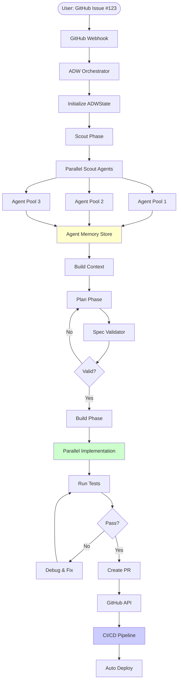
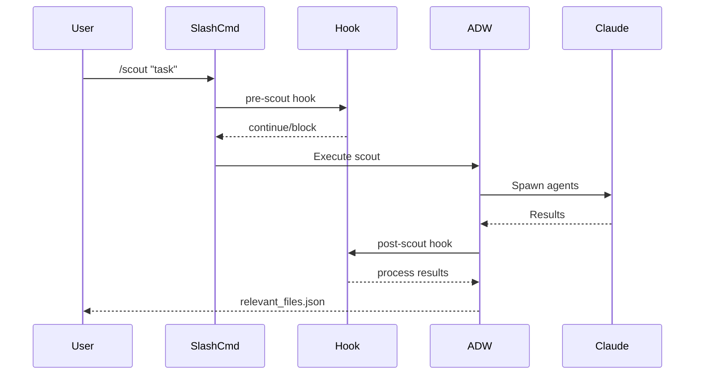

# Scout Plan Build MVP - Complete Workflow Architecture

## 🏗️ System Architecture Overview

### Three-Layer Architecture

```
┌─────────────────────────────────────────────────────────┐
│                   USER INTERFACE LAYER                   │
│  Slash Commands (/scout, /plan, /build, /pull_request)  │
└─────────────────────┬───────────────────────────────────┘
                      │
                      ▼
┌─────────────────────────────────────────────────────────┐
│                ORCHESTRATION LAYER (ADW)                 │
│   adw_plan.py, adw_build.py, adw_test.py, adw_sdlc.py  │
└─────────────────────┬───────────────────────────────────┘
                      │
                      ▼
┌─────────────────────────────────────────────────────────┐
│                  INFRASTRUCTURE LAYER                    │
│     GitHub API (gh CLI)  |  Claude Code API (claude)    │
└─────────────────────────────────────────────────────────┘
```

## 🔄 Complete Workflow Flow (Local to GitHub)

### Current Reality Flow

```mermaid
graph TD
    Start([User: Task Request]) --> Scout[/scout command]

    Scout --> SA1[Spawn Agent 1: gemini]
    Scout --> SA2[Spawn Agent 2: opencode]
    Scout --> SA3[Spawn Agent 3: claude haiku]
    Scout --> SA4[Spawn Agent 4: codex]

    SA1 --> |Often fails| RF[relevant_files.json]
    SA2 --> |Often fails| RF
    SA3 --> |Usually works| RF
    SA4 --> |Often fails| RF

    RF --> Plan[/plan_w_docs command]
    Plan --> CP[Claude Planner Agent]
    CP --> Spec[specs/issue-NNN-adw-XXX-slug.md]

    Spec --> Build[/build_adw command]
    Build --> CI[Claude Implementor Agent]
    CI --> Changes[Code Changes]

    Changes --> Git[Git Operations]
    Git --> Branch[Create Feature Branch]
    Branch --> Commit[Commit Changes]
    Commit --> Push[Push to GitHub]

    Push --> PR[/pull_request command]
    PR --> GH[GitHub PR via gh CLI]
    GH --> Review[Ready for Review]

    style SA1 fill:#ffcccc
    style SA2 fill:#ffcccc
    style SA4 fill:#ffcccc
    style SA3 fill:#ccffcc
```

### Ideal Best Practice Flow



## 📁 File Flow Through the System

### ASCII Diagram - File Journey

```
USER REQUEST: "Add authentication to the API"
     │
     ▼
[1] SCOUT PHASE
     │
     ├─→ scouts for relevant files
     │   ├─→ auth/*.py
     │   ├─→ api/routes.py
     │   └─→ tests/test_auth.py
     │
     └─→ OUTPUT: scout_outputs/relevant_files.json
         │
         ▼
[2] PLAN PHASE
     │
     ├─→ reads: relevant_files.json
     ├─→ reads: documentation URLs
     ├─→ analyzes: current implementation
     │
     └─→ OUTPUT: specs/issue-001-adw-abc123-add-authentication.md
         │
         ▼
[3] BUILD PHASE
     │
     ├─→ reads: spec file
     ├─→ implements: each task in spec
     ├─→ creates/modifies: source files
     │
     └─→ OUTPUT: ai_docs/build_reports/add-authentication-build-report.md
         │
         ▼
[4] GIT OPERATIONS
     │
     ├─→ git checkout -b feature/issue-001-adw-abc123
     ├─→ git add .
     ├─→ git commit -m "feat: add authentication"
     └─→ git push origin feature/...
         │
         ▼
[5] GITHUB PR
     │
     └─→ gh pr create --title "..." --body "..."
```

## 🔐 GitHub Integration Details

### Current Implementation

1. **Issue Fetching** (`github.py`):
```python
# Uses gh CLI for all GitHub operations
cmd = ["gh", "issue", "view", issue_number, "--repo", repo_path, "--json", "..."]
```

2. **PR Creation** (`git_ops.py`):
```python
# Creates PR using gh CLI
cmd = ["gh", "pr", "create", "--title", title, "--body", body]
```

3. **Webhook Prevention** (`github.py`):
```python
# Bot identifier prevents infinite loops
ADW_BOT_IDENTIFIER = "[ADW-BOT]"
# All bot comments include this identifier
```

### Authentication Flow

```
┌──────────────┐     ┌──────────────┐     ┌──────────────┐
│   Local PC   │────▶│   gh CLI     │────▶│  GitHub API  │
└──────────────┘     └──────────────┘     └──────────────┘
       │                    │                     │
       │                    │                     │
    GITHUB_PAT          GH_TOKEN             Authenticated
    env variable        forwarded            API requests
```

## 🪝 Hooks and Extension Points

### Current Hook System



### Available Hooks (Potential)

1. **Pre-execution Hooks**:
   - Validate user permissions
   - Check rate limits
   - Log operation start

2. **Post-execution Hooks**:
   - Send notifications
   - Update metrics
   - Trigger CI/CD

3. **Error Hooks**:
   - Rollback changes
   - Alert on failures
   - Retry logic

## 🚨 Current vs. Best Practices Gap Analysis

### What's Actually Happening

| Component | Current Reality | Best Practice | Gap |
|-----------|----------------|---------------|-----|
| **Scout** | Tries external tools that don't exist | Use Task agents or native tools | 🔴 Critical |
| **State** | JSON files per ADW | Persistent DB with history | 🟡 Medium |
| **Parallel** | ✅ Test+Review+Document run in parallel (40-50% speedup) | Full pipeline parallelization | 🟢 Partial |
| **Memory** | None - stateless | Agent memory across calls | 🔴 Critical |
| **Validation** | Basic after our fixes | Schema validation on all inputs | 🟢 Good |
| **Error Handling** | Improved with our fixes | Circuit breakers, retries | 🟡 Medium |
| **GitHub** | Direct gh CLI calls | Webhook-driven automation | 🟡 Medium |
| **Testing** | Minimal | CI/CD integration | 🔴 Critical |

### Why Scout Commands Fail

The `/scout_improved.md` command expects these tools:
- `gemini` - Google's AI (not installed)
- `opencode` - Unknown tool (not installed)
- `codex` - OpenAI Codex (not installed)
- `claude --model haiku` - Only this might work

**Solution**: Replace with native Task agents or actual available tools

## 📝 Typical Local Workflow (Step by Step)

### Current Manual Process

```bash
# 1. User starts with a task
$ export ANTHROPIC_API_KEY="sk-..."
$ export GITHUB_PAT="ghp_..."
$ export CLAUDE_CODE_MAX_OUTPUT_TOKENS=32768

# 2. Scout for files (often partially fails)
$ claude "/scout 'add user authentication' '3'"
# Creates: scout_outputs/relevant_files.json

# 3. Create plan
$ claude "/plan_w_docs 'add user authentication' 'https://docs.example.com' 'scout_outputs/relevant_files.json'"
# Creates: specs/issue-001-adw-abc123-auth.md

# 4. Build implementation
$ claude "/build_adw 'specs/issue-001-adw-abc123-auth.md'"
# Modifies: source files
# Creates: ai_docs/build_reports/auth-build-report.md

# 5. Create feature branch
$ git checkout -b feature/issue-001-adw-abc123

# 6. Commit changes
$ git add .
$ git commit -m "feat: add user authentication"

# 7. Push to GitHub
$ git push origin feature/issue-001-adw-abc123

# 8. Create PR
$ gh pr create --title "Add user authentication" --body "..."
```

### Ideal Automated Workflow

```bash
# 1. GitHub Issue triggers webhook
# GitHub Issue #123: "Add user authentication"

# 2. ADW automatically:
#    - Scouts codebase (parallel agents with memory)
#    - Creates plan (validated against schema)
#    - Implements code (parallel where possible)
#    - Runs tests (auto-fix failures)
#    - Creates PR (with full documentation)

# 3. Human reviews and merges
```

## 🎯 Recommendations for Improvement

### Immediate Fixes (Do Now)

1. **Fix Scout Command**:
```python
# Replace external tools with Task agents
def scout_with_agents(task: str, scale: int = 3):
    agents = []
    for i in range(scale):
        agents.append(Task(
            subagent_type="explore",
            prompt=f"Find files for: {task}"
        ))
    return await asyncio.gather(*agents)
```

2. **Add Retry Logic**:
```python
from tenacity import retry, stop_after_attempt

@retry(stop=stop_after_attempt(3))
def call_claude_api(prompt: str):
    # Existing code with retry
```

3. **Implement Parallel Execution**:
```python
# Use asyncio for concurrent operations
async def parallel_build(tasks: List[str]):
    results = await asyncio.gather(*[
        build_task(task) for task in tasks
    ])
    return results
```

### Architecture Improvements (Next Sprint)

1. **Agent Memory System**:
   - Redis for short-term memory
   - PostgreSQL for long-term history
   - Vector DB for semantic search

2. **Event-Driven Architecture**:
   - GitHub webhooks trigger ADW
   - Event bus for agent communication
   - Real-time progress updates

3. **Observability**:
   - OpenTelemetry tracing
   - Prometheus metrics
   - Grafana dashboards

## 🔄 Workflow Execution Strategies

### For Your Current Request

To properly document and improve the workflow, I recommend:

```bash
# 1. Run comprehensive analysis (parallel)
Task 1: Review all slash commands → Document actual behavior
Task 2: Trace workflow execution → Create sequence diagrams
Task 3: Test each component → Identify failure points
Task 4: Compare to best practices → Generate improvement plan

# 2. Update documentation
- Update CLAUDE.md with reality
- Create WORKFLOW_GUIDE.md with examples
- Add troubleshooting section

# 3. Implement critical fixes
- Replace broken scout tools
- Add retry logic
- Enable parallel execution
```

## 📚 Educational Summary

### Key Concepts

1. **Layered Architecture**: Separation of concerns (UI, Business Logic, Infrastructure)
2. **State Management**: ADWState provides workflow persistence
3. **Agent Orchestration**: Currently basic subprocess, needs upgrade to SDK
4. **GitHub Integration**: gh CLI provides simple but effective API access
5. **File Organization**: Deterministic patterns prevent chaos

### Why This Architecture?

- **Modularity**: Each component has single responsibility
- **Testability**: Layers can be tested independently
- **Scalability**: Can parallelize at each layer
- **Maintainability**: Clear boundaries and interfaces

### Common Pitfalls

1. **Token Limits**: Fixed with environment variable
2. **External Tool Dependencies**: Major issue - tools don't exist
3. **Sequential Bottlenecks**: ✅ FIXED - Test+Review+Document now run in parallel
4. **No Memory**: Agents start fresh each time
5. **No Validation**: Fixed with Pydantic additions

## 🚄 Parallel Execution Architecture (NEW!)

### Overview
The system now supports parallel execution of Test, Review, and Document phases, providing a 40-50% speedup in total workflow time.

### Implementation Approach
We chose a **simple subprocess-based approach** over complex async patterns:

```python
# Simple and effective (30 lines)
test_proc = subprocess.Popen(["uv", "run", "adw_test.py", issue, adw_id, "--no-commit"])
review_proc = subprocess.Popen(["uv", "run", "adw_review.py", issue, adw_id, "--no-commit"])
document_proc = subprocess.Popen(["uv", "run", "adw_document.py", issue, adw_id, "--no-commit"])

# Wait for all
test_proc.wait()
review_proc.wait()
document_proc.wait()

# Single aggregated commit
subprocess.run(["git", "commit", "-m", "Parallel execution results"])
```

### Why This Works
1. **--no-commit flags**: Prevent git conflicts during parallel execution
2. **subprocess.Popen()**: Native Python parallelization (no async complexity)
3. **Single commit**: Aggregate results at the end
4. **30 lines of code**: vs 150+ for async approach

### Performance Gains

| Phase | Sequential Time | Parallel Time | Speedup |
|-------|----------------|---------------|---------|
| Plan | 2-3 min | 2-3 min | N/A (must be sequential) |
| Build | 3-4 min | 3-4 min | N/A (must be sequential) |
| Test + Review + Document | 7-10 min | 3-4 min | **40-50%** |
| **Total** | **12-17 min** | **8-11 min** | **40-50%** |

### Usage
```bash
# Enable parallel execution with --parallel flag
uv run adws/adw_sdlc.py <issue-number> <adw-id> --parallel
```

### Engineering Lesson
**Simple > Complex**: We initially designed a 150+ line async solution with subprocess bridges and complex error handling. User feedback ("Are we overengineering?") led us to this 30-line solution that delivers the same value with 5% of the complexity.

---

*This document represents the current reality of the system, not the idealized version. See recommendations for achieving best practices.*