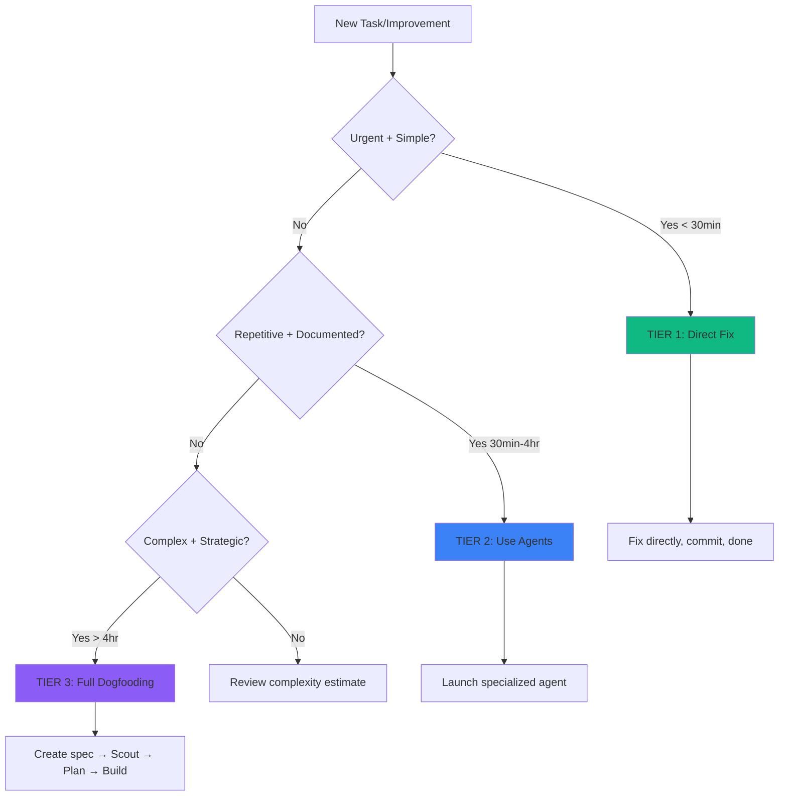

# 🎯 Three-Tier Improvement Strategy

## Philosophy: Right Tool for the Right Job

**Don't over-engineer simple problems. Don't under-engineer complex ones.**

This document establishes best practices for implementing improvements to the scout_plan_build_mvp framework, using a three-tier approach based on complexity, urgency, and dogfooding opportunities.

---

## Three-Tier Decision Framework



---

## TIER 1: Quick Wins (DO NOW)

### When to Use
- **Urgency**: Critical security fixes, blocking bugs
- **Complexity**: < 30 minutes to implement
- **Scope**: Single file, clear solution
- **Examples**: Security patches, typo fixes, dependency updates

### Process
```bash
# 1. Fix directly
vim file.py

# 2. Test (if applicable)
pytest tests/

# 3. Commit
git add file.py
git commit -m "security: Fix command injection in scout"

# 4. Done!
```

### When NOT to Use
- ❌ Changes affecting multiple files
- ❌ Architectural changes
- ❌ New features requiring design
- ❌ Anything that might need rollback

### Current TIER 1 Tasks
- [x] Command injection in scout_simple.py (DONE!)
- [ ] Webhook authentication
- [ ] Path traversal fix with symlink check
- [ ] Update .gitignore for common patterns

---

## TIER 2: Automated Improvements (USE AGENTS)

### When to Use
- **Complexity**: 30 minutes - 4 hours
- **Pattern**: Repetitive, documented process
- **Scope**: Multiple files, clear execution plan
- **Examples**: README consolidation, code refactoring, documentation updates

### Process
```bash
# 1. Identify which specialized agent to use
# - docs-architect: Documentation tasks
# - code-reviewer: Code quality improvements
# - frontend-developer: UI improvements
# - backend-architect: Architecture analysis

# 2. Launch agent with detailed prompt
Task(
    subagent_type="docs-architect",
    prompt="Consolidate READMEs following the plan in [...].
    Specific actions: ..."
)

# 3. Review output
# 4. Commit changes
```

### Best Practices
1. **Give agents detailed execution plans** - Don't make them guess
2. **Use appropriate agent types** - Match expertise to task
3. **Review output carefully** - Agents can make mistakes
4. **Commit in logical chunks** - Not everything at once

### Current TIER 2 Tasks
- [ ] README consolidation (docs-architect with scout's plan)
- [ ] Create missing READMEs for /docs/, /agents/, /ai_docs/analyses/
- [ ] Fix Mermaid diagram syntax (already have working diagrams)
- [ ] Standardize non-standard README filenames

---

## TIER 3: Strategic Projects (FULL DOGFOODING)

### When to Use
- **Complexity**: > 4 hours, architectural changes
- **Scope**: Multiple modules, new capabilities
- **Impact**: Framework-level improvements
- **Examples**: Agents SDK, Serena MCP, new workflow phases

### Process: Use Our Own Framework!
```bash
# 1. CREATE SPEC (if needed)
# Agents SDK already has spec!
# For new work, create spec in specs/

# 2. SCOUT
# Use parallel scout for comprehensive discovery
python adws/adw_scout_parallel.py "implement Agents SDK" 6

# 3. PLAN
# Generate implementation plan from scout results
/plan_w_docs "implement Agents SDK" \
    "https://docs.anthropic.com/agents" \
    "scout_outputs/relevant_files.json"

# 4. BUILD
# Implement the plan
/build_adw "specs/issue-XXX-adw-SDK-agents-sdk.md"

# 5. PARALLEL QA
# Test + Review + Document in parallel
uv run adws/adw_sdlc.py XXX SDK --parallel

# 6. PR
# Create pull request for review
gh pr create --title "feat: Agents SDK implementation"
```

### Why Dogfooding Matters
1. **Validates the framework** - If it can improve itself, it works!
2. **Finds gaps** - Using it reveals missing features
3. **Demonstrates value** - "Eating your own dog food"
4. **Creates examples** - Future users see real usage

### Current TIER 3 Projects

#### 1. Agents SDK Integration (READY TO START!)
**Status**: Spec exists! (`specs/agents-sdk-implementation-plan.md`)
**Timeline**: 2-4 weeks (8 weeks for full implementation)
**Approach**: Full Scout→Plan→Build dogfooding

**Why TIER 3:**
- Replaces subprocess.Popen() with proper agent invocation
- Adds memory persistence (game changer!)
- Enables true parallel coordination
- Strategic architectural change

**Quick Win Path** (Week 1):
```python
# Create basic SDK wrapper
agents_sdk/
├── core/
│   ├── session.py      # Wrap subprocess with session
│   └── orchestrator.py # Parallel coordination
└── memory/
    └── serena.py       # Serena MCP integration
```

#### 2. Serena MCP Integration
**Status**: Needs spec
**Timeline**: 1 week
**Approach**: Create spec first, then Scout→Plan→Build

**Why TIER 3:**
- Enables persistent memory across sessions
- Scouts that remember discoveries!
- Learning system that improves over time
- Foundational for intelligent agents

**Spec Requirements**:
- How to configure Serena MCP
- What to store (discoveries, patterns, learnings)
- How scouts access memory
- Memory schema design

---

## Decision Matrix

| Task Type | Urgency | Complexity | Time | Tier | Approach |
|-----------|---------|------------|------|------|----------|
| Security fix | 🔴 High | Low | < 30m | 1 | Direct fix |
| Bug fix | 🟡 Medium | Low | < 30m | 1 | Direct fix |
| Typo/docs | 🟢 Low | Low | < 15m | 1 | Direct fix |
| README consolidation | 🟡 Medium | Medium | 2-3h | 2 | docs-architect |
| Code refactoring | 🟢 Low | Medium | 2-4h | 2 | code-reviewer |
| New feature (small) | 🟢 Low | Medium | 2-4h | 2 | Appropriate agent |
| Agents SDK | 🟡 Medium | High | 2-4w | 3 | Full dogfooding |
| Serena MCP | 🟡 Medium | High | 1w | 3 | Full dogfooding |
| New workflow phase | 🟢 Low | High | 1-2w | 3 | Full dogfooding |

---

## Best Practices from Outside the Framework

### 1. "Make it work, make it right, make it fast"
- **Tier 1**: Make it work (fix the bug)
- **Tier 2**: Make it right (clean up the code)
- **Tier 3**: Make it fast (optimize the architecture)

### 2. "YAGNI" (You Aren't Gonna Need It)
- Don't create specs for simple fixes
- Don't use the full framework for typos
- Don't over-engineer obvious solutions

### 3. "Eat Your Own Dog Food"
- Use Scout→Plan→Build to improve Scout→Plan→Build
- Find framework gaps by using the framework
- Demonstrate value through self-improvement

### 4. "The Right Tool for the Right Job"
- Hammer for nails, saw for wood
- Direct fixes for simple problems
- Agents for repetitive work
- Full pipeline for strategic work

---

## Specification Guidelines

### When to Create Specs

**YES - Create Spec:**
- ✅ New features (> 4 hours work)
- ✅ Architectural changes
- ✅ Complex integrations
- ✅ Multi-phase projects
- ✅ Anything using Scout→Plan→Build

**NO - Don't Create Spec:**
- ❌ Bug fixes (< 30 minutes)
- ❌ Security patches (urgent)
- ❌ Documentation updates
- ❌ Typo corrections
- ❌ Dependency updates

### Spec Template Location
- Use existing spec schema from `docs/SPEC_SCHEMA.md`
- Save to `specs/issue-XXX-adw-YYY-description.md`
- Follow v1.1.0 schema format

---

## Implementation Roadmap

### This Week (TIER 1 Focus)
1. [x] Fix command injection (DONE!)
2. [ ] Add webhook authentication (30 min)
3. [ ] Fix path traversal vulnerabilities (45 min)
4. [ ] Update .gitignore (15 min)

### Next Week (TIER 2 Focus)
1. [ ] README consolidation via docs-architect (2-3 hours)
2. [ ] Create /docs/README.md master index (1 hour)
3. [ ] Create /agents/README.md explanation (30 min)
4. [ ] Standardize README naming (1 hour)

### Weeks 3-4 (TIER 3: Agents SDK Quick Win)
1. [ ] Create basic SDK wrapper around subprocess
2. [ ] Integrate Serena MCP for memory
3. [ ] Test with parallel scouts
4. [ ] Document SDK usage

### Weeks 5-8 (TIER 3: Full SDK Implementation)
1. [ ] Follow 8-week plan from specs/agents-sdk-implementation-plan.md
2. [ ] Use Scout→Plan→Build for each phase
3. [ ] Dogfood the framework to build better framework
4. [ ] Create comprehensive SDK documentation

---

## Success Metrics

### TIER 1 Success
- ✅ Fixed within 30 minutes
- ✅ No new bugs introduced
- ✅ Single, focused commit
- ✅ Immediate verification

### TIER 2 Success
- ✅ Agent completes task autonomously
- ✅ Output quality > 80%
- ✅ Time savings vs manual (>30%)
- ✅ Documented approach for future

### TIER 3 Success
- ✅ Framework successfully used itself
- ✅ Spec → Scout → Plan → Build → PR complete
- ✅ New capability added
- ✅ Comprehensive documentation
- ✅ Tests passing
- ✅ Demonstrates dogfooding value

---

## Anti-Patterns to Avoid

### ❌ Over-Engineering
- Creating specs for simple fixes
- Using agents for single-file changes
- Full pipeline for documentation updates

### ❌ Under-Engineering
- Direct fixes for architectural changes
- No specs for complex features
- Skipping Scout→Plan→Build for strategic work

### ❌ Analysis Paralysis
- Spending hours planning 30-minute fixes
- Creating elaborate specs for obvious solutions
- Over-thinking simple decisions

### ❌ Premature Optimization
- Optimizing before it works
- Adding features before validating need
- Complex solutions to simple problems

---

## The Meta-Framework

This three-tier approach IS the framework learning about itself:

```
Framework learns best practices
    ↓
Codifies them in IMPROVEMENT_STRATEGY.md
    ↓
Uses itself to implement improvements
    ↓
Discovers new patterns
    ↓
Updates strategy
    ↓
(repeat)
```

**This document will evolve** as we learn what works. That's the whole point!

---

## Quick Reference

```bash
# TIER 1: Direct Fix (< 30 min, urgent)
vim file.py && git commit -m "fix: description"

# TIER 2: Use Agent (30min - 4hr, repetitive)
Task(subagent_type="docs-architect", prompt="...")

# TIER 3: Full Dogfooding (> 4hr, strategic)
adw_scout_parallel.py → /plan → /build → adw_sdlc.py --parallel
```

---

*"The right tool for the right job. No more, no less."*

*With gratitude to indydevdan (tacticalengineering.com) for engineering principles that made this possible.*