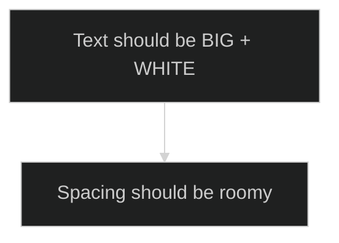

```mermaid
%%{init: {
  "theme": "dark",
  "themeVariables": {
    "fontSize": "16px",
    "primaryTextColor": "#fff",
    "padding": 20
  }
}}%%
flowchart TB
  A[Text should be BIG + WHITE] --> B[Spacing should be roomy]
```