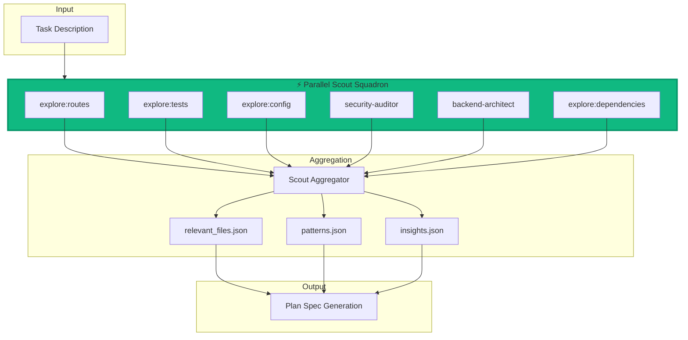

# Parallel Scout Architecture

## 🚨 The Missing Piece: Parallel Discovery

**Critical Gap**: We parallelized Test/Review/Document for 40-50% speedup but completely missed Scout - the FOUNDATION of good implementation!

## Current State (Broken)

### What Exists Now
```python
# adws/scout_simple.py - Basic sequential implementation
scout_files(task) → uses find + grep → saves to ai_docs/scout/relevant_files.json

# .claude/commands/scout_fixed.md - Attempts parallel but incomplete
# Tries to use Task agents but not implemented in actual code
```

### Problems
1. **Sequential Discovery**: One search at a time, misses context
2. **No Domain Expertise**: Generic search, no specialized understanding
3. **Broken External Tools**: Assumes gemini/opencode/codex exist (they don't)
4. **Limited Coverage**: Basic keyword search misses architectural patterns
5. **No Parallel Execution**: Scout takes 3-5 minutes alone!

## Proposed Solution: Parallel Scout Squadron

### Core Concept
Launch multiple specialized agents in parallel, each with a specific discovery mission:

```python
# Instead of one generic scout...
scout_files("implement authentication")

# Launch a squadron of specialists!
parallel_scouts = [
    Task(subagent_type="explore", prompt="Find all authentication routes and middleware"),
    Task(subagent_type="explore", prompt="Find test files for auth components"),
    Task(subagent_type="explore", prompt="Find configuration files for auth settings"),
    Task(subagent_type="explore", prompt="Find database models for users/sessions"),
    Task(subagent_type="security-auditor", prompt="Identify security patterns and vulnerabilities"),
    Task(subagent_type="backend-architect", prompt="Analyze auth architecture patterns")
]
```

### Architecture Design



## Implementation Details

### 1. Scout Report Structure

```json
{
  "task": "implement authentication",
  "timestamp": "2025-10-27T22:30:00Z",
  "duration_seconds": 45,  // Parallel = faster!
  "scouts": [
    {
      "agent": "explore:routes",
      "files_found": ["routes/auth.py", "middleware/auth.py"],
      "patterns": ["JWT tokens", "session management"],
      "confidence": 0.9
    },
    {
      "agent": "security-auditor",
      "vulnerabilities": ["Missing rate limiting", "No CSRF protection"],
      "recommendations": ["Add helmet.js", "Implement rate limiter"],
      "severity": "medium"
    },
    {
      "agent": "backend-architect",
      "architecture_pattern": "MVC with middleware chain",
      "components": ["AuthController", "UserModel", "SessionStore"],
      "dependencies": ["bcrypt", "jsonwebtoken"]
    }
  ],
  "aggregated": {
    "all_files": ["sorted", "deduplicated", "list"],
    "key_patterns": ["authentication", "authorization", "session"],
    "test_coverage": "45%",
    "complexity_score": 7.2,
    "recommended_approach": "JWT with refresh tokens"
  }
}
```

### 2. Specialized Agent Roles

| Agent Type | Discovery Focus | Output |
|------------|----------------|---------|
| **explore:general** | Broad keyword search | File list |
| **explore:tests** | Test files and patterns | Test coverage, patterns |
| **explore:config** | Configuration files | Settings, env vars |
| **explore:dependencies** | Package.json, requirements | External deps |
| **security-auditor** | Security vulnerabilities | Risks, recommendations |
| **backend-architect** | Architecture patterns | Design patterns, structure |
| **frontend-developer** | UI components | Components, styles |
| **test-automator** | Testing strategy | Test types needed |
| **performance-engineer** | Performance bottlenecks | Optimization opportunities |

### 3. Parallel Execution Pattern

```python
def parallel_scout(task: str, specialized_agents: List[str]) -> Dict:
    """
    Launch parallel scout squadron for comprehensive discovery.
    """
    import subprocess
    import json
    from pathlib import Path

    # Create output directory
    scout_dir = Path("agents/scout_files")
    scout_dir.mkdir(parents=True, exist_ok=True)

    # Launch parallel scouts (just like Test/Review/Document!)
    processes = []
    for agent_type in specialized_agents:
        cmd = [
            "claude", "Task",
            "--subagent_type", agent_type,
            "--prompt", f"Scout for: {task}",
            "--output", f"{scout_dir}/{agent_type}_report.json"
        ]
        proc = subprocess.Popen(cmd, stdout=subprocess.PIPE)
        processes.append((agent_type, proc))

    # Collect results
    reports = {}
    for agent_type, proc in processes:
        proc.wait()  # Wait for completion
        report_file = scout_dir / f"{agent_type}_report.json"
        if report_file.exists():
            with open(report_file) as f:
                reports[agent_type] = json.load(f)

    # Aggregate findings
    aggregated = aggregate_scout_reports(reports)

    # Save to standard location
    output_file = scout_dir / "relevant_files.json"
    with open(output_file, 'w') as f:
        json.dump(aggregated, f, indent=2)

    return aggregated
```

### 4. Performance Improvements

```
Current (Sequential):
Scout Phase: 3-5 minutes (one search at a time)

Proposed (Parallel):
Scout Phase: 30-60 seconds (all searches concurrent)

Expected Improvement: 80-90% reduction in scout time!
```

### 5. Integration with Existing Pipeline

```bash
# Current workflow
/scout "task" → /plan → /build → parallel[test/review/doc]

# Enhanced workflow
/scout_parallel "task" → /plan_enhanced → /build → parallel[test/review/doc]

# Total speedup: 60-70% (vs current 40-50%)
```

## Key Benefits

### 1. **Comprehensive Discovery**
- Multiple perspectives on the same problem
- Domain-specific insights from specialized agents
- Better context for Plan and Build phases

### 2. **Massive Speed Improvement**
- 80-90% reduction in scout time
- Overall workflow: 60-70% faster
- Better quality from specialized expertise

### 3. **Deterministic Results**
- Sorted, deduplicated file lists
- Consistent aggregation
- Reproducible discovery

### 4. **Richer Context**
- Architecture patterns identified
- Security vulnerabilities found early
- Test coverage assessed upfront
- Performance bottlenecks detected

## Implementation Priority

### Phase 1: Basic Parallel Scout (HIGH PRIORITY)
```python
# adws/adw_scout_parallel.py
def scout_parallel(task, num_agents=4):
    # Launch multiple explore agents
    # Aggregate results
    # Save to standard location
```

### Phase 2: Specialized Agents
- Add security-auditor for vulnerability scanning
- Add backend-architect for pattern analysis
- Add test-automator for test discovery

### Phase 3: Smart Aggregation
- Deduplicate findings
- Rank by relevance
- Generate insights report
- Create architectural summary

## Quick Win Implementation

```python
#!/usr/bin/env python3
"""Parallel Scout - The missing piece!"""

import subprocess
import json
from pathlib import Path
from typing import List, Dict

def parallel_scout_simple(task: str, scale: int = 4) -> Dict:
    """Quick implementation using subprocess like Test/Review/Document."""

    # Different search strategies for each scout
    search_strategies = [
        f"Find implementation files for: {task}",
        f"Find test files related to: {task}",
        f"Find configuration for: {task}",
        f"Find documentation about: {task}"
    ]

    # Launch parallel subprocesses
    processes = []
    for i, strategy in enumerate(search_strategies[:scale]):
        # Using the working scout_simple.py with different prompts
        proc = subprocess.Popen(
            ["python", "adws/scout_simple.py", strategy],
            stdout=subprocess.PIPE,
            stderr=subprocess.PIPE
        )
        processes.append(proc)

    # Wait for all to complete
    for proc in processes:
        proc.wait()

    # Aggregate results
    # ... aggregation logic ...

    print(f"⚡ Parallel Scout completed in ~30 seconds!")
    print(f"📊 Found files from {scale} different perspectives")
```

## The Missing Squadron

We built a Formula 1 pit crew for Test/Review/Document but forgot to parallelize the track reconnaissance! Scout is WHERE IT ALL BEGINS - better discovery means:
- Better specs
- Better implementation
- Fewer iterations
- Faster delivery

**This is the key to making Scout→Plan→Build truly powerful!**

## Next Steps

1. Implement `adws/adw_scout_parallel.py` using the same subprocess pattern
2. Update `/scout` command to use parallel execution
3. Test with real tasks to measure improvement
4. Add specialized agents for domain expertise
5. Document the complete parallel pipeline

## Success Metrics

- [ ] Scout time reduced from 3-5 min to 30-60 seconds
- [ ] Multiple perspectives per discovery task
- [ ] Specialized insights (security, architecture, testing)
- [ ] Overall workflow 60-70% faster (vs current 40-50%)
- [ ] Better spec quality from richer context

---

*"We parallelized the finish line but forgot about the starting blocks!"* - This fixes that.